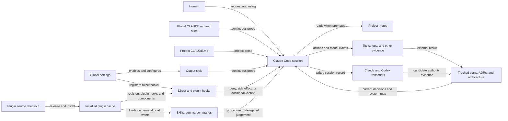

# Instruction control — Context (Level 0)

> System boundary: the cross-cutting system that supplies instructions to a Claude Code
> session, constrains selected actions, recalls project knowledge, and records evidence
> about what happened. Plugins and marketplaces are deployment packaging within this
> system, not its architectural boundary.

This document separates the source candidate in this worktree from the live state observed
on host `foa4008439` on 2026-08-11. The governing design is
[`2026-08-11-instruction-control-system.md`](../../design-plans/2026-08-11-instruction-control-system.md).

## Context

The diagram distinguishes two kinds of control. Prose and loaded components influence
model behaviour. A hook controls an action only when it returns a permission decision or
performs the side effect itself. `additionalContext` is advice even when a hook delivered
it.

## Current surfaces

| Surface | Producer and owner | Consumer | Current mechanism | Authority or evidence | Invalidation and failure |
|---|---|---|---|---|---|
| Global `CLAUDE.md` | Human-maintained, machine-local configuration | Every Claude session | Loaded as continuous instructions | Live file, observed digest below | Each machine may differ. Prose has no execution receipt. The file currently contains legacy `claude-sync` procedure. |
| Project `CLAUDE.md` | Repository maintainers | Sessions in this repository | Loaded as project instructions | [`CLAUDE.md`](../../../CLAUDE.md) source candidate | Candidate contains runtime boundaries, repository contracts, and finding aids only; main checkout remains unchanged until integration. |
| Global `CLAUDE.md` candidate | Repository-maintained deployment candidate | Live global file after an explicit deployment | Continuous cross-project instructions | `deployment/instruction-control/foa4008439/CLAUDE.md`, bound by adjacent `candidate-manifest.json` | The manifest state is `source-candidate`; it is not evidence of live installation. |
| Global rules | Human-maintained, machine-local configuration | Matching Claude sessions | Loaded by Claude Code | Live `~/.claude/rules/context7.md`, observed digest below | Machine-local drift; no repository review or deployment receipt. |
| Output style | Plugin source, selected by global settings | Every response in the configured session | Claude Code loads the selected Markdown style | Live settings and installed file digests below | The settings identifier names `denubis-plan-and-execute` while the observed installed source is under `denubis-academic`; this document does not infer how Claude resolves that mismatch. |
| Direct hooks | Human-maintained global settings and scripts | Claude Code event dispatcher | Commands registered directly in `settings.json` | Live settings digest below | Machine-local and outside this repository. A zero exit or context message is not proof that the intended policy held. |
| Plugin hooks | Plugin source, enabled by global settings | Claude Code event dispatcher | Event registrations in each plugin's `hooks.json` | Source files cited in the event table | Source, marketplace metadata, cache, and enablement can drift independently. |
| Skills and commands | Plugin source | Main session when invoked or injected | Markdown procedures loaded on demand; some are injected by hooks | Plugin context pages and source files | Applicability and completion usually depend on model judgement unless a separate check supplies evidence. |
| Agents and external advisors | Plugin source plus model/runtime | Main session and human | Delegated work returned as model output | Source-tagged result; some paths verify source access | A fluent report is not proof. The proposer and verifier can share blind spots. |
| Project `.notes/` | Human-approved, gitignored project memory | Main session | Direct task-entry inventory, frontmatter read, and relevant-body read | Main-repository `.notes/`; 50 Markdown files observed below | Hidden and ignored scope makes incomplete search look empty. Frontmatter and referenced evidence can drift. |
| Human transcripts | Claude and Codex runtimes | Human, search tools, authority-bearing documents | Vendor JSONL and transcript archives; installed `cc-search-chats` 2.0.0a5 currently describes itself as Claude-only | Raw record and exact message locator | Provider schemas and paths differ. Cross-vendor search is prospective. A summary or model quotation is not the human invocation. |
| Plans, ADRs, notes, constraints, and architecture | Repository or project authors | Humans and future sessions | Markdown memorials and living maps | Resolvable source pointer or repository evidence | A broken pointer is an integrity defect. Correction layers create palimpsests rather than current documents. |
| Tests and hook logs | Executed mechanism | Human or a downstream gate | External result bound to an artifact or event | Test output or structured log | Self-report is not evidence. A result without subject identity or invalidation rules cannot bind later action. |

## Event topology

This is the source registration topology, not a claim that every hook is installed or
fires successfully on every machine.

| Event | Registration | Effect class | Observable behaviour |
|---|---|---|---|
| `SessionStart` | global settings | Context | Emits the current date. |
| `SessionStart` | `denubis-plan-and-execute` | Side effect | Updates the crash-recovery live marker; it emits no generic workflow context (`plugins/denubis-plan-and-execute/hooks/hooks.json`). |
| `SessionStart` | `denubis-hook-branch-bg` | User-interface side effect | Recolours the terminal from repository and branch identity; ordinary success is silent (`plugins/denubis-hook-branch-bg/hooks/branch-bg.py::main`). |
| `PreToolUse:Write\|Edit` | `denubis-plan-and-execute` | Permission decision or context | Denies selected writes and warns on others (`plugins/denubis-plan-and-execute/hooks/hooks.json`, `215efb9`). |
| `PreToolUse:Bash` | global approver | Permission decision or context | Runs the machine-local approver before Bash. This repository does not own or test it. |
| `PreToolUse:Bash` | dispatcher plus sibling guards | Permission decision or context | Discovers sibling `pretooluse-bash.sh` programs; the fork guard can deny a `gh` target (`plugins/denubis-hook-pretooluse-dispatcher/hooks/hooks.json`, `215efb9`; `plugins/denubis-hook-gh-fork-guard/hooks/pretooluse-bash.sh`, `566f230`). |
| `PostToolUse:Bash` | global approver | Context | Runs the same machine-local approver after Bash. |
| `Notification` | global settings | User-interface side effect | Calls the machine-local session notification script. |

## Responsibility boundaries

| Responsibility | Current owner | Boundary |
|---|---|---|
| Human authority | The original human invocation in a raw transcript | Notes, ADRs, plans, and model reports can point to authority; they do not manufacture it. |
| Current system description | Living architecture | Architecture describes deployed reality. The design plan owns proposed removals and contracts until implementation lands. |
| Project memory | `.notes/` | Notes preserve local observations and feedback. They are neither executable policy nor decision authority by themselves. |
| Decisions | ADRs and dated decision records | A decision record memorialises one decision. Current records do not yet share a validated authority-pointer contract. |
| Situational procedure | Skills and commands | Procedures say how to act in a named situation. Their prose does not prove invocation or success. |
| Mechanical action control | Permission hooks and executable gates | Only the matching boundary is controlled. Advisory context from the same hook remains prose. |
| Behavioural feedback | Tests, external results, and event logs | Evidence binds an identified artifact or event. Model critique and self-description remain claims. |
| Packaging and deployment | Plugin source, marketplace catalogue, installed cache, global settings | These answer what can be installed and what is enabled. They are not the decomposition axis for instruction control. |

## Source and deployment boundary

The repository contains plugin source and catalogue metadata. A live session consumes
machine-local configuration and installed cache content. Therefore a source edit is not
evidence of deployment, and an enabled-plugin entry is not evidence that the cache holds
the same bytes.

Observed machine-local artifacts on 2026-08-11:

| Artifact | SHA-256 |
|---|---|
| `/home/brian/.claude/CLAUDE.md` | `9140934f252ec41ce931958111391c562c53fb8eb99c1958ca9b6713aea700dc` |
| `/home/brian/.claude/settings.json` | `dfe0909c0d4bff5726a1c83abfd3a10bad84d51221e8eabfedc98cf3e865b17a` |
| `/home/brian/.claude/plugins/installed_plugins.json` | `5b144defd1eab7ca2f1f3471724939ff6f3725d1d146f350e0f13ffa3e274311` |
| `/home/brian/.claude/rules/context7.md` | `89bb452cb064b48513f318508c0ece59a31cd6d9fec334a2dccd763f64a5e46a` |
| Installed `denubis-academic/0.14.0/output-styles/academic-writing.md` | `039898cbcce93e8ac421392efa9c8644dd4b4f4dd5484435dfa4461be0c525a7` |
| `/home/brian/.local/bin/cc-search-chats`, package metadata 2.0.0a5 | `1d94f04e95cefc02ad84981d2444619aad93aaf1b0ca0fc0438c7f2ec815e35c` |
| Main-repository `.notes/*.md` sorted digest list, 50 files | `c305e1df1df08dd5a3824062ee11cf2c96ab41efe3e030149dac0f070ad74112` |

These are observation stamps, not synchronization policy. Recompute them before relying
on the snapshot. Each machine's live `~/.claude` is authoritative for that machine;
remote shell access does not imply replicated state.

## Exclusions

- Proposed removals, the target authority-reference schema, and future evidence-stamp
  consumers remain in the design plan until implemented.
- Marketplace ordering and catalogue presentation do not define this system boundary.
- Model weights and vendor instruction resolution internals are external.
- The crash-recovery database is documented separately in
  [`database.md`](../database.md).
