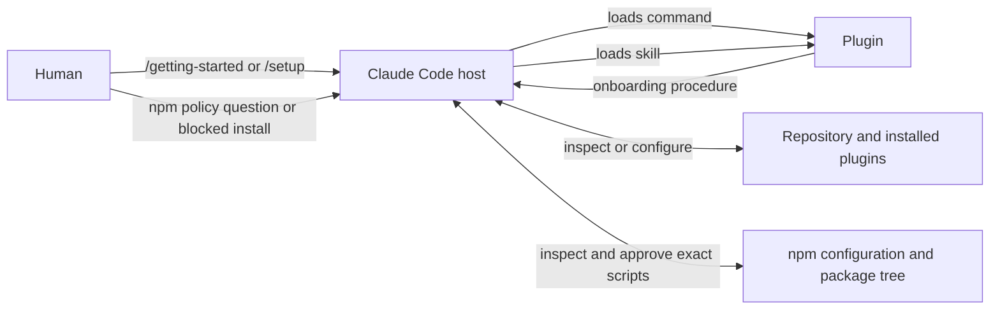

# denubis-00-getting-started — Context (Level 0)

> System boundary: onboarding commands plus the machine's npm install-script policy
> procedure.

## Context

## What the plugin ships

| Component | Responsibility |
|---|---|
| `/getting-started` | Shows the opening sections of the repository README (`plugins/denubis-00-getting-started/commands/getting-started.md`, `6eb8e31`). |
| `/setup` | Inspects and configures statusline, plugin enablement, and version consistency (`plugins/denubis-00-getting-started/commands/setup.md`, `199ccdc`). |
| `npm-install-script-policy` | Explains the observed npm install-script controls and the inspect-before-approval procedure for blocked lifecycle scripts (`plugins/denubis-00-getting-started/skills/npm-install-script-policy/SKILL.md`, `583ec14`). |

## Boundary and failure modes

- The commands are one-shot procedures. Nothing in this plugin continuously detects
  configuration drift.
- `/setup` can inspect and edit configuration through the Claude Code tools it declares;
  the command body is advice, not a mechanical guarantee that each check ran.
- The npm skill documents a machine policy verified against named npm versions. It does
  not control npm by being loaded; npm configuration and package-level approvals do.
- Package-install approval requires reading the exact script and approving an exact
  version. A name-only future approval crosses the boundary the policy is intended to
  preserve.

## Cross-references

- **Plugin manifest:** `plugins/denubis-00-getting-started/.claude-plugin/plugin.json`,
  version 1.5.0 (`583ec14`).
- **Cross-cutting instruction control:** [`../../instruction-control/0-context.md`](../../instruction-control/0-context.md).
