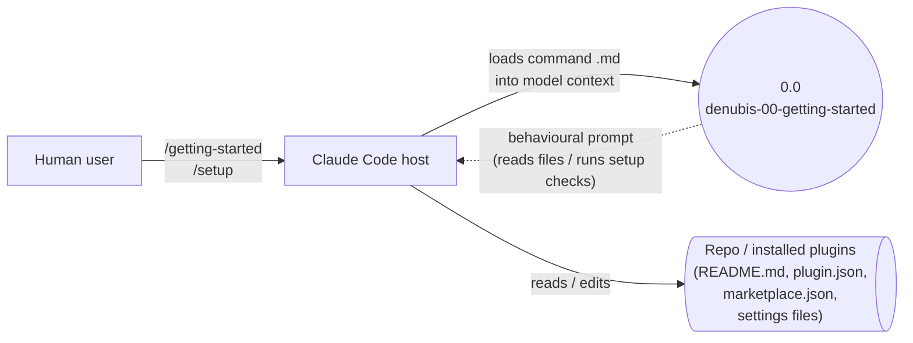

# denubis-00-getting-started — Context (Level 0)

> System boundary: a commands-only plugin that wires `/getting-started` and `/setup` slash commands to onboarding and post-install verification flows.

## Diagram

## External Entities

| Entity | Description | Inputs to System | Outputs from System |
|--------|-------------|------------------|---------------------|
| Human user | Invokes the slash commands. | `/getting-started`, `/setup` typed at the prompt | (the model's reply, driven by the command's body) |
| Claude Code host | Resolves slash commands by loading the command markdown file as a behavioural prompt for the next turn. | The `/<command>` invocation | Command markdown content injected into model context |
| Repo / installed plugins | The artifacts the commands inspect or modify: top-level `README.md`, `plugin.json` files, `marketplace.json`, status-line settings, plugin-enablement state. | Reads + occasional edits via Claude Code's `Read`, `Edit`, `Write`, `Bash`, `Glob`, `Grep`, `AskUserQuestion` tools (declared in `plugins/denubis-00-getting-started/commands/setup.md::allowed-tools`, `c44693d`) | Edits to user settings / `plugin.json` versions during setup |

## System Boundary

**In scope:**
- `/getting-started` — show the first two sections of `@../../README.md` to the user, stopping before `Installation` (`plugins/denubis-00-getting-started/commands/getting-started.md`, `6eb8e31`).
- `/setup` — verify and configure denubis-plugins setup: status line, plugin enablement, and version sync. Declares the full edit toolset (`Read, Edit, Write, Bash, Glob, Grep, AskUserQuestion`) in its `allowed-tools` frontmatter (`plugins/denubis-00-getting-started/commands/setup.md`, `c44693d`).

**Out of scope:**
- Skills, agents, hooks, scripts — none ship in this plugin.
- Continuous validation — the commands are one-shot; nothing watches for drift after `/setup` completes.

## What This Plugin Ships

### Commands (`plugins/denubis-00-getting-started/commands/`)

| Command | Description (frontmatter) |
|---------|---------------------------|
| `/getting-started` | Show the denubis-plugins README and getting-started information (`getting-started.md`, `6eb8e31`). |
| `/setup` | Verify and configure denubis-plugins setup — status line, plugin enablement, version sync (`setup.md`, `c44693d`). |

## Cross-References

- **Plugin manifest:** `plugins/denubis-00-getting-started/.claude-plugin/plugin.json` (`78d0568`), version 1.4.0. Manifest description: *"Getting started guide and onboarding for denubis-plugins."*
- **Marketplace entry:** `.claude-plugin/marketplace.json` (`18f3b80`).
- **Shared docs:** `../../README.md`, `../../glossary.md`, `../../constraints.md`.
