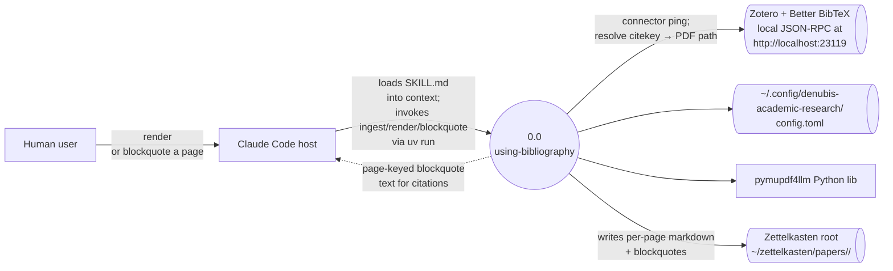

# denubis-academic: using-bibliography — Context (Level 0)

> **Scope note (2026-08-01).** This document describes the `using-bibliography`
> skill only. It was written when that skill was the whole of the former
> `denubis-bibliography` plugin, which has since been absorbed into
> `denubis-academic` alongside `academic-writing` and `paper-review`. Paths and
> the plugin name below have been updated, but the boundary this document draws
> is now one skill's, not the plugin's. The manifest version it cites was already
> stale before the move. Treat the surrounding claims as scoped to
> `using-bibliography` until a Level 0 for the whole plugin is written.

> System boundary: renders Zotero-managed PDFs to per-page markdown under `~/zettelkasten/papers/<citekey>/` and emits page-keyed blockquotes for use as verified citations. The skill's own frontmatter and manifest mark this workflow as WIP — only the path validated end-to-end on one paper is documented.

## Diagram

## External Entities

| Entity | Description | Inputs to System | Outputs from System |
|--------|-------------|------------------|---------------------|
| Human user | Invokes the skill `/using-bibliography` (`user-invocable: true`) when wanting to render a paper or surface a blockquote. | Citekey + page or quote range | Rendered markdown files; blockquote snippets returned in the model's reply |
| Claude Code host | Loads `SKILL.md` and runs the helper Python scripts via Bash/uv. | Skill invocation | Skill body as behavioural prompt + tool calls into the helper scripts |
| Zotero + Better BibTeX | Local Zotero application with the Better BibTeX plugin, reachable via JSON-RPC at `http://localhost:23119`. The skill explicitly *does not* fetch papers itself — the user adds them via the Zotero connector (`plugins/denubis-academic/skills/using-bibliography/SKILL.md`, `18f3b80`). | Connector ping (`/connector/ping`); citekey-to-attachment lookups | PDF attachment paths + bibliographic metadata |
| `~/.config/denubis-academic-research/config.toml` | User-owned configuration with the zettelkasten root path. Skill halts if missing rather than fabricating a default (`SKILL.md::Hard preconditions`, `18f3b80`). | Config values | (none) |
| `~/zettelkasten/papers/<citekey>/` | Where rendered markdown lands. User-owned directory — skill halts rather than creating it silently (`SKILL.md::Hard preconditions`, `18f3b80`). | (none) | Per-page markdown files and blockquote snippets produced by the helpers |
| `pymupdf4llm` Python library | The PDF-to-markdown converter used by `render.py`. Skill requires it to be installed in a usable venv (`SKILL.md::Hard preconditions`, `18f3b80`). | PDF bytes | Page-numbered markdown |

## System Boundary

**In scope:**
- The single skill `using-bibliography` and its three helper scripts:
  - `ingest.py` — accepts a list of DOIs / citekeys and drives the per-paper render pipeline (`plugins/denubis-academic/skills/using-bibliography/ingest.py`, `18f3b80`).
  - `render.py` — converts a PDF to per-page markdown via `pymupdf4llm` (`render.py`, `18f3b80`).
  - `blockquote.py` — produces a page-keyed blockquote with a pandoc-style citation for a given page span (`blockquote.py`, `18f3b80`).
- Halting on missing preconditions: Zotero not running, missing config, missing zettelkasten root, or missing `pymupdf4llm` (`SKILL.md::Hard preconditions`, `18f3b80`).
- A self-described WIP marker — only one paper's workflow (`yimTeachersPerceptionsAttitudes2024`, dated 2026-05-11) is validated end-to-end (`SKILL.md`, `18f3b80`).

**Out of scope:**
- Fetching PDFs from the internet — the skill explicitly does not do this; papers must be added via the Zotero connector first (`SKILL.md::When NOT to use`, `18f3b80`).
- Editing the user's permanent notes — only renders/blockquotes are emitted; permanent-note authoring stays with the user or a human-supervised agent (`SKILL.md::When NOT to use`, `18f3b80`).
- Anything beyond the single validated path — the WIP notice is the truthful scope statement.

## What This Plugin Ships

### Skills (`plugins/denubis-academic/skills/`)

| Skill | User-invocable? | Description (frontmatter, abbreviated) |
|-------|-----------------|----------------------------------------|
| `using-bibliography` | yes | Render a PDF from the user's Zotero corpus to per-page markdown, or surface a page-keyed blockquote. Consumes Zotero output via Better BibTeX JSON-RPC; never fetches papers itself. `last-reviewed: 2026-05-11`. (`using-bibliography/SKILL.md`, `18f3b80`) |

### Skill-adjacent helper scripts (under `skills/using-bibliography/`)

| Script | Purpose |
|--------|---------|
| `ingest.py` (`18f3b80`) | Batch ingest from DOIs/citekeys — drives the render pipeline per paper. |
| `render.py` (`18f3b80`) | PDF-to-markdown conversion via `pymupdf4llm`. |
| `blockquote.py` (`18f3b80`) | Emit a page-keyed blockquote with a pandoc-style citation for a given span. |

### Other plugin files

| File | Purpose |
|------|---------|
| `references.bib` (`18f3b80`) | A BibTeX bibliography file shipped with the plugin. |

## Cross-References

- **Plugin manifest:** `plugins/denubis-academic/.claude-plugin/plugin.json` (`18f3b80`), version 0.1.0. Manifest description: *"Render PDFs from a Zotero corpus to per-page markdown for engagement; emit page-keyed blockquotes with pandoc-style citations. WIP — only documents the workflow proven end-to-end so far."*
- **Marketplace entry:** `.claude-plugin/marketplace.json` (`18f3b80`).
- **Shared docs:** `../../README.md`, `../../glossary.md`, `../../constraints.md`.
