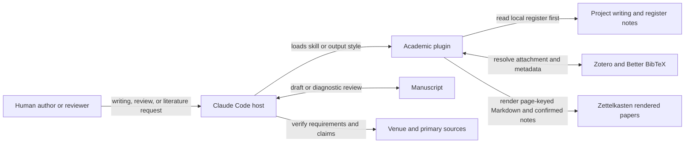

# denubis-academic — Context (Level 0)

> System boundary: scholarly writing and review procedures, a continuous academic
> output style, and Zotero-to-Markdown helpers for source-grounded literature work.

## Context

## What the plugin ships

| Component | Responsibility |
|---|---|
| `academic-writing` skill | Loads project register notes before drafting or revising, then applies the portable prose and revision discipline (`plugins/denubis-academic/skills/academic-writing/SKILL.md`, `8dae417`). |
| `paper-review` skill | Runs a diagnostic manuscript review across independent lanes while keeping defects, concerns, competing readings, and uncertainty distinct (`plugins/denubis-academic/skills/paper-review/SKILL.md`, `ba8acdb`). |
| `using-bibliography` skill | Routes Zotero resolution, rendering, source-fidelity checks, confirmed writes, bibliography refresh, notes, and installation recovery (`plugins/denubis-academic/skills/using-bibliography/SKILL.md`). |
| `Academic Writing` output style | Holds the portable prose register continuously while retaining coding instructions (`plugins/denubis-academic/output-styles/academic-writing.md`, `8dae417`). |
| Bibliography helpers | `resolve.py` is the front door; `ingest.py` handles DOI batches; `render.py` owns the render cascade; the remaining helpers preview and perform bounded Zotero or quotation operations (`plugins/denubis-academic/skills/using-bibliography/`). |

## External boundaries

| Entity | Contract |
|---|---|
| Project `.notes/` | Project-specific register and writing rules override the portable floor after the procedure opens them. |
| Zotero and Better BibTeX | Own bibliographic records, citekeys, attachment resolution, and registered project exports. The plugin does not silently create, copy, repair, annotate, or fetch corpus items. |
| `zotero-api-plus` | Optionally exposes capability-probed write and forced-export endpoints. Every user-data mutation is previewed and confirmed. |
| Zettelkasten | Stores rendered paper text by resolved citekey for source inspection. |
| Venue guidance | Supplies current submission requirements. The review procedure verifies current official guidance when the project has no dated copy. |
| Human | Owns authorial intent, durable register approval, and acceptance of manuscript changes. |

## Boundary and failure modes

- The output style supplies continuous prose guidance. It does not perform the
  `academic-writing` skill's note-loading or revision workflow.
- A diagnostic review discusses the manuscript; it does not silently edit it.
- Rendered Markdown supports source inspection. Clean text-layer page Markdown
  can ground an exact quote; OCR Markdown is only a locator until the wording is
  visually checked against the source PDF.
- Installed helpers resolve from Claude's plugin root and do not depend on a
  developer checkout or caller working directory. `${CLAUDE_PLUGIN_ROOT}`
  resolves anywhere it appears in skill and agent content
  (code.claude.com/docs/en/plugins-reference, verified 2026-08-14).
- Missing Zotero, configuration, attachment, renderer, or zettelkasten preconditions
  block only the literature operation that depends on them.
- A project register can override the portable writing floor. The session must read it;
  a one-line project summary is not a substitute.

## Cross-references

- **Plugin manifest:** `plugins/denubis-academic/.claude-plugin/plugin.json`, version
  0.15.0.
- **Bundled bibliography:** `plugins/denubis-academic/references.bib` (`42a3287`).
- **Cross-cutting instruction control:** [`../../instruction-control/0-context.md`](../../instruction-control/0-context.md).
