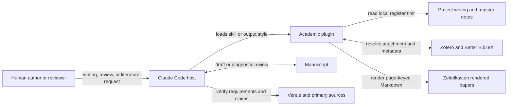

# denubis-academic — Context (Level 0)

> System boundary: scholarly writing and review procedures, a continuous academic
> output style, and Zotero-to-Markdown helpers for source-grounded literature work.

## Context

## What the plugin ships

| Component | Responsibility |
|---|---|
| `academic-writing` skill | Loads project register notes before drafting or revising, then applies the portable prose and revision discipline (`plugins/denubis-academic/skills/academic-writing/SKILL.md`, `8dae417`). |
| `paper-review` skill | Runs a diagnostic manuscript review across independent lanes while keeping defects, concerns, competing readings, and uncertainty distinct (`plugins/denubis-academic/skills/paper-review/SKILL.md`, `ba8acdb`). |
| `using-bibliography` skill | Resolves Zotero-managed sources and renders or retrieves page-keyed Markdown without independently fetching papers (`plugins/denubis-academic/skills/using-bibliography/SKILL.md`, `0441064`). |
| `Academic Writing` output style | Holds the portable prose register continuously while retaining coding instructions (`plugins/denubis-academic/output-styles/academic-writing.md`, `8dae417`). |
| Bibliography helpers | `ingest.py` drives per-paper ingestion; `render.py` converts PDFs; `blockquote.py` emits page-keyed blockquotes (`plugins/denubis-academic/skills/using-bibliography/ingest.py`, `d3602a6`; `plugins/denubis-academic/skills/using-bibliography/render.py`, `42a3287`; `plugins/denubis-academic/skills/using-bibliography/blockquote.py`, `42a3287`). |

## External boundaries

| Entity | Contract |
|---|---|
| Project `.notes/` | Project-specific register and writing rules override the portable floor after the procedure opens them. |
| Zotero and Better BibTeX | Own bibliographic records and attachment resolution. The plugin does not silently create or fetch corpus items. |
| Zettelkasten | Stores rendered paper text by resolved citekey for source inspection. |
| Venue guidance | Supplies current submission requirements. The review procedure verifies current official guidance when the project has no dated copy. |
| Human | Owns authorial intent, durable register approval, and acceptance of manuscript changes. |

## Boundary and failure modes

- The output style supplies continuous prose guidance. It does not perform the
  `academic-writing` skill's note-loading or revision workflow.
- A diagnostic review discusses the manuscript; it does not silently edit it.
- Rendered Markdown supports source inspection. A model's citation or summary is not
  verified merely because a rendered paper exists.
- Missing Zotero, configuration, attachment, renderer, or zettelkasten preconditions
  block only the literature operation that depends on them.
- A project register can override the portable writing floor. The session must read it;
  a one-line project summary is not a substitute.

## Cross-references

- **Plugin manifest:** `plugins/denubis-academic/.claude-plugin/plugin.json`, version
  0.14.0 (`b5595dc`).
- **Bundled bibliography:** `plugins/denubis-academic/references.bib` (`42a3287`).
- **Cross-cutting instruction control:** [`../../instruction-control/0-context.md`](../../instruction-control/0-context.md).
