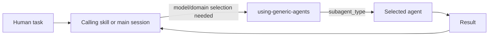

# denubis-basic-agents — Context (Level 0)

> System boundary: five Task-dispatchable agents and one situational selection skill.

## Context

## Current contracts

| Surface | Responsibility |
|---|---|
| `using-generic-agents` | Select a domain-specific or generic agent and the appropriate model tier when delegation is already warranted. |
| `sonnet-general-purpose` | General delegated work at the suite's normal floor. |
| `opus-general-purpose` | Delegated work requiring deeper reasoning or judgment. |
| `haiku-general-purpose` | Callable but has no default dispatch site; use needs a positive bounded justification. |
| `python-developer` | Python implementation with the repository's modern-Python defaults. |
| `academic-researcher` | Academic research and writing with citation discipline. |

The plugin does not run at SessionStart. Agent selection is useful only at the point
where a caller has already decided to delegate.

## Boundary and failure modes

- The plugin supplies agents; it does not decide that delegation is needed.
- The selection skill supplies a procedure, not evidence that the selected agent's
  result is correct.
- Model availability and installed versions are deployment concerns.

## Cross-references

- **Plugin manifest:** `plugins/denubis-basic-agents/.claude-plugin/plugin.json`, version
  2.2.1.
- **Marketplace entry:** `.claude-plugin/marketplace.json`.
- **Primary consumers:** plan-and-execute skills and agents.
