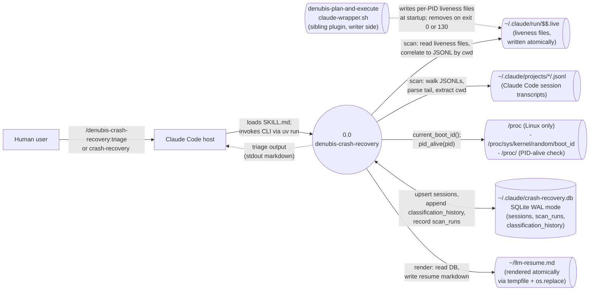

# denubis-crash-recovery — Context (Level 0)

> System boundary: a Linux-only crash-recovery plugin that identifies and resumes Claude Code sessions which ended abnormally (SIGKILL, SIGSEGV, kernel kill, reboot, terminal disconnect). Combines liveness-file detection (via the sibling `denubis-plan-and-execute` plugin's patched `claude-wrapper.sh`) with JSONL-tail-only heuristics; a deterministic Python rule table classifies every session; SQLite at `~/.claude/crash-recovery.db` is the source of truth; `~/llm-resume.md` regenerates byte-identically from DB state.

## Diagram

## External Entities

| Entity | Description | Inputs to System | Outputs from System |
|--------|-------------|------------------|---------------------|
| Human user | Invokes the `/denubis-crash-recovery:triage` skill, or runs `crash-recovery <subcommand>` directly. Reads `~/llm-resume.md`. | Skill invocation; CLI invocations; `crash-recovery note <uuid> "<text>"` for manual annotation | Triage report (stdout); `~/llm-resume.md` (filesystem); session annotation persisted in DB |
| Claude Code host | Loads `SKILL.md` into context for `/triage`; invokes the CLI via `uv run` using the Bash tool. | Skill invocation | Skill body as behavioural prompt + tool calls |
| `denubis-plan-and-execute` (sibling plugin) | The wrapper-side writer. Patched `claude-wrapper.sh` writes `~/.claude/run/$$.live` atomically at startup and removes it conditionally on clean exit (status 0 or 130). Requires version ≥ 2.32.2. | (none — this plugin reads what the wrapper writes) | (none — this plugin is the consumer) |
| `~/.claude/run/<pid>.live` files | Per-wrapper-PID liveness markers. Four key=value lines: `cwd`, `started`, `argv`, `boot_id`. Atomic via tempfile + `mv` (`rename(2)`). Absence after abnormal exit is the crash signal. | (none — this is a Filesystem location the plugin reads) | (none) |
| `~/.claude/projects/*/<uuid>.jsonl` | Claude Code's per-session transcript files. The plugin walks these to extract session UUIDs, the `cwd` from the first user message, and the tail kind for classification. | (none — Filesystem read) | (none) |
| `/proc/sys/kernel/random/boot_id` (Linux) | Kernel-provided boot identifier. Compared against each liveness file's `boot_id` to detect post-reboot casualties. | (none — read at scan time) | (none) |
| `/proc/<pid>` (Linux) | Used by `liveness.pid_alive(pid)` to determine whether a wrapper PID is still running. | (none — read at scan time) | (none) |

## System Boundary

**In scope:**
- **Classification.** `crash_recovery.classify::classify()` and `RULES` produce one of `live`, `hard_crash`, `borderline`, `concluded`, `irrecoverable` from a fixed feature tuple (`liveness_present`, `pid_alive`, `boot_id_current`, `tail_kind`, `cwd_present`). Deterministic; one parametrised assertion per row in `tests/test_classify.py::test_every_rule_classifies_its_fixture`. (`plugins/denubis-crash-recovery/scripts/crash_recovery/src/crash_recovery/classify.py`.)
- **End-to-end scan.** `crash_recovery.scan::run_scan` orchestrates: walk `~/.claude/run/` + `~/.claude/projects/`; correlate liveness files to JSONL UUIDs; compute features; classify; single-transaction upsert into SQLite; orphan sweep for stale rows. (`scan.py`.)
- **Render + atomic resume-file write.** `crash_recovery.render::render(db_path)` returns a byte-stable markdown string; `__main__::_render_to_file` writes via `tempfile.NamedTemporaryFile(dir=output.parent) + os.replace`. (`render.py`, `__main__.py`.)
- **Manual annotation + audit trail.** `crash-recovery note <uuid> "<text>"` attaches user notes; `crash-recovery history <uuid>` shows the classification trail. Annotations exempt the row from `_orphan_sweep` re-classification. (`note.py`, `history.py`.)
- **Gated prune.** `crash-recovery prune --dry-run` previews; `--confirm` deletes — only rows where classification == `concluded` AND `user_notes IS NULL` AND `jsonl_path` no longer on disk AND `classifier_version` matches the current `CLASSIFIER_VERSION`. (`prune.py`.)
- **User-facing triage flow.** The `denubis-crash-recovery:triage` skill walks the user through scan → triage report → optional annotation → gated prune. (`plugins/denubis-crash-recovery/skills/triage/SKILL.md`.)
- **Local-filesystem refusal.** `scan`, `render`, `regenerate` exit code 2 if `CRASH_RECOVERY_RUN_DIR` or the render output's parent is on a network/union filesystem (NFS, CIFS, sshfs, FUSE, overlayfs). (`liveness.py::assert_local_filesystem`.)
- **Linux-only guard.** `scan` exits code 2 on non-Linux platforms; the other subcommands work cross-platform against an existing DB. (`__main__.py::scan`.)

**Out of scope:**
- **Writer side.** The plugin does not write liveness files itself — it consumes what `denubis-plan-and-execute`'s wrapper writes. Cross-plugin contract documented in `docs/architecture/constraints.md` § "Writer-side liveness lifecycle (Phase 8)".
- **Retroactive recovery.** Sessions that ran before the wrapper was installed have no liveness file; they cannot be classified as `hard_crash` (every `HARD_CRASH` rule requires `liveness_present=True`). Retroactive recovery via mtime-clustering against `last -F` output is a planned future extension; design seed at `docs/design-plans/2026-05-19-post-mortem-crash-detection.md`.
- **LLM judgement on borderline cases.** Borderline classifications are surfaced for the user to annotate manually; no model judgement participates in classification.
- **Automatic pruning.** Prune is explicit only (`--dry-run` then `--confirm`); no scheduled cleanup.
- **byobu/tmux-resurrect helpers.** Out of scope for v1.0.0.

## What This Plugin Ships

### CLI subcommands (`plugins/denubis-crash-recovery/scripts/crash_recovery/src/crash_recovery/__main__.py`)

| Subcommand | Purpose |
|------------|---------|
| `init` | Create the SQLite schema at `~/.claude/crash-recovery.db` (idempotent). |
| `scan` | Walk filesystem, classify sessions, upsert into DB (Linux-only). |
| `render` | Emit the resume markdown to stdout. |
| `regenerate` | Atomically write the resume markdown to `~/llm-resume.md` (or `CRASH_RECOVERY_RESUME_PATH`). |
| `triage` | Combined scan + render with section headers (the human-facing flow). |
| `note` | Attach a user note to a session UUID. |
| `history` | Show the `classification_history` trail for a UUID. |
| `prune` | Delete `concluded`+`user_notes IS NULL`+vanished-JSONL+current-classifier rows (gated). |
| `list-live` | List sessions classified `live` (skips `boot_id_current` filter so it shows mid-classification state). |

### Skills (`plugins/denubis-crash-recovery/skills/`)

| Skill | User-invocable? | Description (frontmatter) |
|-------|-----------------|---------------------------|
| `triage` | yes | Orchestrates the user-facing crash-recovery flow: scan → review report → optional annotation → gated prune. |

### Key modules (`plugins/denubis-crash-recovery/scripts/crash_recovery/src/crash_recovery/`)

| Module | Responsibility |
|--------|----------------|
| `db.py` | SQLite schema DDL: `sessions`, `scan_runs`, `classification_history`. `CLASSIFICATION_VALUES` is the schema-locked StrEnum; `open_db(...)` enables WAL mode and `PRAGMA foreign_keys = ON`. |
| `classify.py` | `RULES` table + `classify()` function. First-match deterministic. `CLASSIFIER_VERSION` constant for forward-compat stamping. |
| `liveness.py` | Liveness file parser (`read_liveness`), boot-id reader (`current_boot_id`), PID-alive check (`pid_alive`), local-filesystem refusal (`assert_local_filesystem`). |
| `jsonl.py` | JSONL tail parser (`parse_tail`, `TailKind`, `TailSummary`) and the `_REAL_TYPES` deny-list filtering for top-level `type` values (re-sampling cadence documented in `constraints.md`). |
| `scan.py` | `run_scan()` orchestrator: enumerate JSONLs + liveness files, classify each session (`_classify_fact`), build `SessionFact` / `ScanContext` / `ScanRunResult`. Pure-read; delegates the write block to `scan_db.py`. |
| `scan_db.py` | The four DB-writer helpers consumed by `run_scan`: `_write_scan_run`, `_upsert_session`, `_append_history`, `_orphan_sweep`. Plus `WriteContext`. Single-transaction discipline lives here. Functional-Core / Imperative-Shell separation made explicit at the module boundary (an implementation-time decision not in the original design plan; see Departures from design plan below). |
| `correlate.py` | Maps cwds to encoded project directory names (handles `/` and `.` lossy collapse). |
| `render.py` | Section model + `render()` byte-stable markdown emitter. Signature `render(db_path) -> tuple[str, int]` (string + entry count; tuple form lands in Phase 6 to resolve a TOCTOU window — the Phase 5 plan documents the single-string form). |
| `note.py` / `history.py` / `prune.py` / `list_live.py` | One module per CLI subcommand of similar name. |

### Module Inventory — deliberate private-symbol cross-imports

The following private symbols (leading underscore) are intentionally shared across module boundaries as part of the FCIS module split documented in "Departures from design plan" below:

| Symbol | Defined in | Imported by | Rationale |
|--------|-----------|-------------|-----------|
| `_project_dir_for_cwd` | `correlate.py` | `scan.py` | Read-only path helper needed by the scan orchestrator. Kept private (not in `correlate.__all__`) because it is an implementation detail of the correlation algorithm; `scan.py` is the sole caller. If `correlate.py` ever defines `__all__`, this symbol must be included explicitly or the import at `scan.py:31` will fail at runtime. |

The four `scan_db.py` helpers (`_write_scan_run`, `_upsert_session`, `_append_history`, `_orphan_sweep`) are private-to-the-scan-subsystem by convention: `scan.py` is their only consumer and they are not part of any public API. They do not cross a package boundary.

### Environment variables

| Variable | Default | Purpose |
|----------|---------|---------|
| `CRASH_RECOVERY_DB` | `~/.claude/crash-recovery.db` | SQLite database path. |
| `CRASH_RECOVERY_RUN_DIR` | `~/.claude/run/` | Liveness file directory; the wrapper writes here, the reader scans here. |
| `CRASH_RECOVERY_PROJECTS_ROOT` | `~/.claude/projects/` | Where Claude Code stores JSONL transcripts. |
| `CRASH_RECOVERY_RESUME_PATH` | `~/llm-resume.md` | Resume-file target for `regenerate`. |

### Dependencies

- **Runtime:** Python 3.14+, stdlib only (sqlite3, pathlib, etc.).
- **Sibling plugin:** `denubis-plan-and-execute >= 2.32.2` for the wrapper that writes liveness files. The `scan` subcommand reads what that wrapper writes.
- **Platform:** Linux (for `/proc/sys/kernel/random/boot_id` and `/proc/<pid>`). Non-Linux platforms exit code 2 from `scan` and `triage`; other subcommands work cross-platform against an existing DB.

## Departures from design plan

Two implementation-time choices diverge from `docs/design-plans/2026-05-08-crash-recovery.md` as written. Both are reasoned engineering decisions caught during build; neither has been retroactively edited into the design plan. Stage 2 design-conformance review (2026-05-20) rated both notable.

- **`scan` module split into `scan.py` + `scan_db.py`.** Design plan named a single `crash_recovery.scan` module. Implementation split the orchestrator (`scan.py`: pure-read enumeration + classification) from the four DB-writer helpers (`scan_db.py`: `_write_scan_run`, `_upsert_session`, `_append_history`, `_orphan_sweep`, plus `WriteContext`). The split is a Functional-Core / Imperative-Shell separation at the module boundary; the rationale is recorded in both modules' docstrings. Future plan edits referencing "`scan.py::_orphan_sweep`" by symbol path will not match grep — `_orphan_sweep` lives in `scan_db.py`.
- **No boolean `liveness_present` column on `sessions`.** Design plan line 508 described "liveness presence/absence is recorded in `sessions` as a boolean flag." The implementation instead encodes the same information via a render-side partition: `render.py::LIVENESS_REASONS`, `NO_LIVENESS_REASONS`, `JSONL_ONLY_REASONS` form a disjoint partition over every reason `classify.py::RULES` can emit. `_reduced_confidence_text` reads the reason and returns the appropriate inline warning. The partition is pinned by `test_render.py::test_reason_prefix_partition_is_exhaustive` (any new reason must be assigned to exactly one set or the test fails). The schema is simpler at the cost of an extra render-side guarantee.

## Cross-References

- **Plugin manifest:** `plugins/denubis-crash-recovery/.claude-plugin/plugin.json`, version 1.0.0.
- **Marketplace entry:** `.claude-plugin/marketplace.json`.
- **Design plan:** `docs/design-plans/2026-05-08-crash-recovery.md` (Phases 1-8 design).
- **Implementation plan:** `docs/implementation-plans/2026-05-08-crash-recovery/` (8 phase files + design conformance + UAT requirements + test requirements).
- **Future extension design seed:** `docs/design-plans/2026-05-19-post-mortem-crash-detection.md` (retroactive recovery for sessions that pre-date the wrapper).
- **Sibling plugin (wrapper):** `plugins/denubis-plan-and-execute/scripts/claude-wrapper.sh` (the writer side of the cross-plugin liveness contract).
- **Shared docs:** `../../README.md`, `../../glossary.md`, `../../constraints.md`, `../../database.md`, `../../personae.md`.
