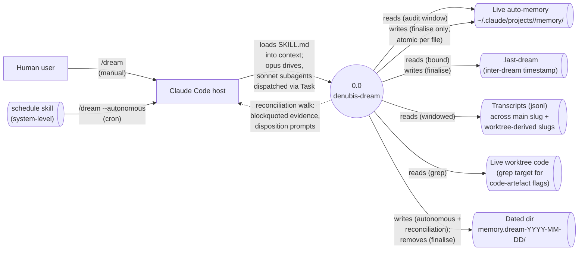

# denubis-dream — Context (Level 0)

> System boundary: a skill-driven plugin that audits per-project auto-memory at `~/.claude/projects/<main-slug>/memory/` against the historical record of Claude Code conversations across the main slug plus its worktree-derived slugs. Produces a reviewable dated-scratch tree without touching live memory during the autonomous pass; interactive reconciliation collects user dispositions and finalises atomically. WIP — design plan landed 2026-05-16; Phase 1 scaffold landed 2026-05-17 (commit `23fa22f`); Phase 2 orchestration landed 2026-05-18 (see git log).

## Diagram

## External Entities

| Entity | Description | Inputs to System | Outputs from System |
|--------|-------------|------------------|---------------------|
| Human user | Invokes `/dream` to audit auto-memory; walks reconciliation memory-by-memory; confirms finalisation. | `/dream` invocation; per-turn dispositions (accept/reject/edit/prune/promote/dismiss); finalise y/n confirmation | Live memory updates at finalisation; dated-dir scratch artefacts for inspection during walk |
| Claude Code host | Loads `SKILL.md`; runs the slash command; dispatches `Task` subagents with `model: claude-sonnet-4-6` overrides; executes `Bash`/`Read`/`Write`/`Edit` tool calls per skill text. | Skill invocation | Skill behavioural prompt + subagent dispatches + filesystem writes |
| `schedule` skill | System-level skill (not part of this plugin) used to register cron jobs. Calls `/dream --autonomous` on the user's chosen cadence (`docs/design-plans/2026-05-16-denubis-dream.md`, `3a26c87`). | Configured cron firing | `/dream --autonomous` invocation prompt |
| Live auto-memory directory (`~/.claude/projects/<main-slug>/memory/`) | The audit target. Per-project markdown files Claude reads at session start, with YAML frontmatter and prose bodies. Touched only at finalisation. | (none during autonomous pass) | Read-only during retrieval and reconciliation; atomic per-file writes at finalisation |
| `.last-dream` artefact (`~/.claude/projects/<main-slug>/.last-dream`) | One-line ISO timestamp of the most recent successful finalisation. Sole inter-dream state outside `memory/` frontmatter (`docs/design-plans/2026-05-16-denubis-dream.md::DR14`, `3a26c87`). | (none) | Read by the corpus-wide flagged-region subagent for windowing; written at finalisation |
| Transcript JSONLs | Read-only across the discovered slug set: the main slug plus exact regex matches of `^<main>--worktrees-.+$` under `~/.claude/projects/` (`docs/design-plans/2026-05-16-denubis-dream.md::DR7`, `3a26c87`). | (none) | Excerpts attached to per-memory `.audit.md` files; raw text for corpus-wide flag scan |
| Live worktree code | Read-only grep target for code-artefact flagging (file paths, function names, schema constants, flag names found in memory bodies). | (none) | Hit/miss results in `.audit.md` `## Code-artefact flags` sections |
| Dated dir (`memory.dream-YYYY-MM-DD/`) | The scratch tree holding all in-progress audit state. Gitignored (DoD #9). Destroyed at finalisation (`docs/design-plans/2026-05-16-denubis-dream.md::DR9`, `3a26c87`). | Decisions appended to `decisions.log` per turn | All proposed-state mirrors, `.audit.md` verdicts, flagged regions, promoted scaffolds, `decisions.log`, optional `SKIPPED.md` |

## System Boundary

**In scope:**
- The single skill `denubis-dream:dreaming` and the `/dream` slash command stub that invokes it.
- Mode detection (`/dream` vs `/dream --autonomous`); main slug resolution from `cwd`; anchored slug-pattern scan of `~/.claude/projects/`.
- Autonomous pass: parallel Sonnet evidence subagents (one per live memory), corpus-wide flagged-region Sonnet subagent (bounded by `.last-dream`), Opus judgement (five gates: holds/correct/useful/duplicate/supported), diff-narrative `.audit.md` writing, mirror writes, MEMORY.md regeneration.
- Reconciliation walk: `mtime`-ascending order, batched keep-cleans, per-stream dispositions (`keep`/`edit`/`prune` for existing memories, `promote`/`dismiss` for flagged regions), Opus-drafted promote scaffolds, JSONL `decisions.log` for walk-state tracking.
- Finalisation: explicit user `y/n` confirmation, per-file atomic writes (`<name>.md.tmp` + `mv`), `.tmp` orphan cleanup, `lastAudited` frontmatter bumps, MEMORY.md replacement, DoD #8 grep self-check, `.last-dream` write, dated-dir removal.
- Resumability: re-invocation of `/dream` while the dated dir exists picks up where the previous run left off (autonomous resume per AC3.7/4.6; walk resume per AC5.7).

**Out of scope:**
- Cross-project memory operations (each project audits its own main slug only) (`docs/design-plans/2026-05-16-denubis-dream.md::DoD-out-of-scope`, `3a26c87`).
- Modifications to upstream `ed3d-plugins`; the plugin is denubis-only.
- Calling Anthropic's `/v1/dreams` Managed Agents API; the pattern is ported locally.
- Audit of memory directories other than the resolved main slug's `memory/` — worktree slugs have no `memory/` of their own to audit.
- Archival of past audit reasoning; the dated dir is destroyed at finalisation (`docs/design-plans/2026-05-16-denubis-dream.md::DR9`, `3a26c87`).
- Automated unit testing of deterministic operations (slug scan, atomic writes, JSONL parsing); DR1 accepts this cost, compensated by an explicit integrity-edge-case UAT checklist (`docs/design-plans/2026-05-16-denubis-dream.md::DR1`, `3a26c87`).

## What This Plugin Ships

### Skills (`plugins/denubis-dream/skills/`)

| Skill | User-invocable? | Description (frontmatter, abbreviated) |
|-------|-----------------|----------------------------------------|
| `dreaming` | invoked via `/dream` command | Audits per-project auto-memory against worktree-aggregated transcripts; produces a dated scratch tree for review; finalises atomically to live memory. Two modes via `--autonomous` flag (`docs/design-plans/2026-05-16-denubis-dream.md`, `3a26c87`). |

### Commands (`plugins/denubis-dream/commands/`)

| Command | Purpose |
|---------|---------|
| `/dream` | Invokes the `dreaming` skill. Accepts optional `--autonomous` flag for cron mode (`docs/design-plans/2026-05-16-denubis-dream.md::Phase-1`, `3a26c87`). |

### Plugin docs (`plugins/denubis-dream/docs/`)

| File | Purpose |
|------|---------|
| `cron-integration.md` | How to register a cron job via the `schedule` skill (`docs/design-plans/2026-05-16-denubis-dream.md::Phase-7`, `3a26c87`). |
| `uat-checklist.md` | Manual verification of all 10 DoD criteria; explicitly covers 5 integrity edge cases that compensate for the no-unit-test posture (`docs/design-plans/2026-05-16-denubis-dream.md::Phase-7`, `3a26c87`). |

## Cross-References

- **Design plan:** `docs/design-plans/2026-05-16-denubis-dream.md` (`3a26c87`) — full architecture, 14 Decision Records, 62 acceptance criteria, 7 implementation phases.
- **Plugin manifest:** `plugins/denubis-dream/.claude-plugin/plugin.json` (`23fa22f`), version `0.1.0`.
- **Marketplace entry:** `.claude-plugin/marketplace.json` (`23fa22f`).
- **Shared docs:** `../../README.md`, `../../glossary.md`, `../../constraints.md`, `../../personae.md`.
