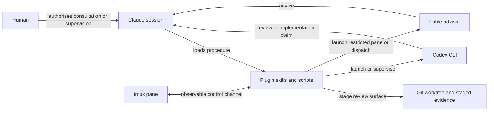

# denubis-external-agents — Context (Level 0)

> System boundary: procedures and launch/supervision scripts that obtain work from a
> model outside the current Claude session and return it as a source-labelled claim.

## Context

## External entities

| Entity | Role at the boundary |
|---|---|
| Human | Authorises cost-gated advice, judges results, and owns commits. |
| Claude session | Stages the task, invokes a procedure, and checks the returned claim. |
| Codex CLI | Supplies a heterogeneous reviewer or supervised worker. Its self-report is not evidence. |
| Fable advisor | Supplies judgement from another model. The pane variant removes write/orchestration tools; ordinary agent dispatch does not. |
| Git worktree and staged evidence | Bounds the working or disclosure surface for launchers and review. |
| tmux | Makes an external session observable and gives the supervisor a separate control channel. |

## What the plugin ships

| Component | Current responsibility |
|---|---|
| `codex-peer-review` | Stages a review target, asks Codex for falsification-first review, and requires provenance checks before presentation (`plugins/denubis-external-agents/skills/codex-peer-review/SKILL.md`, `d17c338`). |
| `consulting-a-fable-advisor` | Handles a human-triggered Fable consultation and distinguishes the advisory agent path from the tool-restricted pane path (`plugins/denubis-external-agents/skills/consulting-a-fable-advisor/SKILL.md`, `aa20f55`). |
| `supervising-codex` | Defines the prompt-file, monitoring, verification, and handover loop for a joined Codex pane (`plugins/denubis-external-agents/skills/supervising-codex/SKILL.md`, `2f11745`). |
| `codex_supervisor.py` | Reads pane state, submits prompt files, monitors events, and writes supervised outputs (`plugins/denubis-external-agents/scripts/codex_supervisor.py`, `c6882d2`). |
| `claude-ponytail`, `codex-ponytail` | Create or reuse isolated worktrees and print launch commands; they do not start the sessions themselves (`plugins/denubis-external-agents/README.md`, `b2a50ec`). |
| `tmux-send-guard` | Guards pane-targeted sends used by external-session control (`plugins/denubis-external-agents/scripts/tmux-send-guard`, `e98528a`). |

## Boundary and failure modes

- The plugin supplies mechanisms for heterogeneous review and supervision. It does not
  make a model report authoritative.
- A staged repository can omit gitignored or external evidence. The review procedure
  marks references outside the staged boundary unverified unless the human explicitly
  authorises inclusion.
- A pane monitor proves an observed pane transition. It does not prove the task was
  correctly understood or completed.
- Fable use is human-triggered. No other skill, hook, or agent may silently cross that
  cost boundary.
- Worktree isolation protects files only to the extent that the launched process and its
  permissions respect that boundary.

## Cross-references

- **Plugin manifest:** `plugins/denubis-external-agents/.claude-plugin/plugin.json`,
  version 0.15.2 (`c6882d2`).
- **Cross-cutting instruction control:** [`../../instruction-control/0-context.md`](../../instruction-control/0-context.md).
- **Shared constraints:** [`../../constraints.md`](../../constraints.md).
