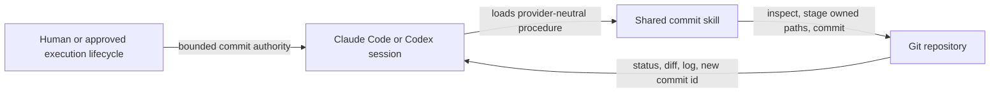

# denubis-git-commit — Context (Level 0)

> System boundary: one explicit-only shared skill that records an authorized coherent
> outcome as a local Git commit without publishing it.

## Context

## Current contracts

| Boundary | Contract |
|---|---|
| Authority | A direct commit request or an approved plan's private-checkpoint lifecycle authorizes the owned local commit. Push, publication, deployment, destructive cleanup, and inherited-history rewriting remain separate. |
| Outcome | Stage one coherent completed outcome rather than files grouped by authoring chronology. If the changes cannot be explained as one outcome, separate them by behavior and dependency. |
| Preflight | Inspect repository root, branch, worktree status, staged and unstaged diffs, untracked files, recent message convention, and applicable project instructions before mutation. |
| Documentation | Update living documentation when the changed behavior makes it false. Do not turn commit messages into the only durable design or operating documentation. |
| Verification | Run the checks that own the staged behavior, inspect the exact staged diff, commit through a message file, then verify the resulting commit and remaining status. |
| Lifecycle | Private checkpoints may be frequent. Fix rounds and superseded checkpoints fold into their coherent outcome only after accepted finished-work human UAT. |

The skill is explicit-only in Codex metadata. Claude's `/commit` entry remains a direct
human invocation. Neither provider may infer permission to push from permission to commit.

## Packaging

- Shared procedure: `plugins/denubis-git-commit/skills/commit/SKILL.md`.
- Claude manifest: `plugins/denubis-git-commit/.claude-plugin/plugin.json`.
- Codex manifest: `plugins/denubis-git-commit/.codex-plugin/plugin.json`.
- Codex invocation policy:
  `plugins/denubis-git-commit/skills/commit/agents/openai.yaml`.
