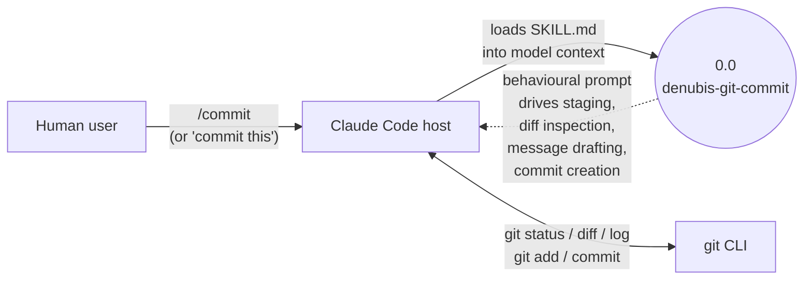

# denubis-git-commit — Context (Level 0)

> System boundary: a single-skill plugin implementing `/commit` as a user-invocable skill that drafts and creates git commits with project-specific message conventions.

## Diagram

## External Entities

| Entity | Description | Inputs to System | Outputs from System |
|--------|-------------|------------------|---------------------|
| Human user | Invokes the skill via `/commit` or by asking Claude to commit. | `/commit` invocation; staged or unstaged changes in the working tree | A git commit (created by Claude via the Bash tool, per the skill's instructions) |
| Claude Code host | Loads `SKILL.md` into context on invocation; runs `git` commands via the `Bash` tool. | Skill invocation | Skill body as a behavioural prompt for the model |
| git CLI | Source of working-tree state and target of the eventual commit. | `git status`, `git diff`, `git log` (read); `git add`, `git commit` (write) — invoked by the model following the skill | A new commit on the current branch |

## System Boundary

**In scope:**
- Drive Claude to run `git status`, `git diff`, and `git log` to inspect changes; draft a commit message that matches the repo's existing style; stage relevant files; create the commit (`plugins/denubis-git-commit/skills/commit/SKILL.md`, `1ef36f5`). The skill is `user-invocable: true` so the user can type `/commit` directly.

**Out of scope:**
- Pushing — no `git push` unless the user separately asks.
- Pre-commit hook bypass — the skill respects `--no-verify` only on explicit user request.
- Authoring `.gitignore`, branch management, or rebase operations.
- Multi-repo or cross-worktree commits.

## What This Plugin Ships

### Skills (`plugins/denubis-git-commit/skills/`)

| Skill | User-invocable? | Description (frontmatter) |
|-------|-----------------|---------------------------|
| `commit` | yes | Create git commits with proper analysis, message drafting, and project conventions. Use when asked to commit, or when `/commit` is invoked. (`commit/SKILL.md`, `1ef36f5`) |

## Cross-References

- **Plugin manifest:** `plugins/denubis-git-commit/.claude-plugin/plugin.json` (`1ef36f5`), version 1.2.1. Manifest description: *"Git commit skill for Claude Code. Handles /commit as a proper skill instead of failing as a non-existent built-in."*
- **Marketplace entry:** `.claude-plugin/marketplace.json` (`18f3b80`).
- **Shared docs:** `../../README.md`, `../../glossary.md`, `../../constraints.md`.
