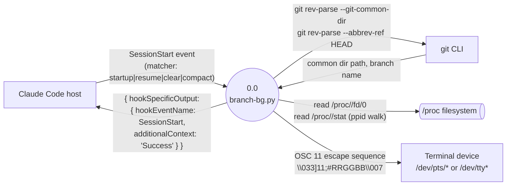

# denubis-hook-branch-bg — Context (Level 0)

> System boundary: a single Python script invoked by Claude Code on session start that recolours the terminal background based on the current git repo and branch.

## Diagram

## External Entities

| Entity | Description | Inputs to System | Outputs from System |
|--------|-------------|------------------|---------------------|
| Claude Code host | Emits the `SessionStart` event that triggers the hook; expects a JSON response on stdout. | `SessionStart` event payload (event name + session metadata) | JSON `hookSpecificOutput` with `hookEventName: "SessionStart"` and `additionalContext: "Success"` (`plugins/denubis-hook-branch-bg/hooks/branch-bg.py::main`, `f0d1846`) |
| git CLI | Invoked twice as a subprocess to learn the repo identity and current branch. | `git rev-parse --git-common-dir`; `git rev-parse --abbrev-ref HEAD` (`branch-bg.py::get_git_info`, `f0d1846`) | Common-dir path; branch name |
| `/proc` filesystem | Read to walk the process tree from the hook's PID up to the controlling terminal. | `readlink /proc/<pid>/fd/0`; `cat /proc/<pid>/stat` (`branch-bg.py::find_terminal`, `f0d1846`) | File-descriptor target; parent PID |
| Terminal device | The `/dev/pts/*` or `/dev/tty*` device file the OSC 11 escape sequence is written to. | OSC 11 string `\033]11;#RRGGBB\007` (`branch-bg.py::set_terminal_bg`, `f0d1846`) | (none) |

## System Boundary

**In scope:**
- Mapping `(git common-dir, branch name)` to an RGB colour and emitting OSC 11 to set the terminal background. Repo path → base hue at L=0.12 / S=0.60; non-main/master branches offset hue ±40°, lightness ±0.03, saturation ±0.10 from the base (`branch-bg.py::git_info_to_colour`, `f0d1846`).
- Walking the process tree from the hook's own PID up to the first PID whose stdin is a `/dev/pts/*` or `/dev/tty*` device, to find the right TTY to write to (`branch-bg.py::find_terminal`, `f0d1846`).
- Returning a `SessionStart` `hookSpecificOutput` JSON object on stdout regardless of whether colouring succeeded (`branch-bg.py::main`, `f0d1846`).

**Out of scope:**
- Persisting or restoring the prior terminal colour (the hook does not save what it overwrites).
- Non-`SessionStart` events — `hooks.json` registers only on `SessionStart` (`plugins/denubis-hook-branch-bg/hooks/hooks.json`, `22d2148`).
- Non-git directories — `get_git_info` returns `(None, None)` and `main` skips the colour step (`branch-bg.py`, `f0d1846`).
- Platforms without `/proc` — `find_terminal` returns `None` and `set_terminal_bg` returns without writing (`branch-bg.py::find_terminal`, `f0d1846`).
- Failure reporting — `subprocess` errors, `OSError`, and `PermissionError` are caught silently (`branch-bg.py::get_git_info`, `set_terminal_bg`, `f0d1846`).

## Hook Registration

Registered in `plugins/denubis-hook-branch-bg/hooks/hooks.json` (`22d2148`):

- **Event:** `SessionStart`
- **Matcher:** `startup|resume|clear|compact`
- **Command:** `uv run python "${CLAUDE_PLUGIN_ROOT}/hooks/branch-bg.py"`
- **Timeout:** 5 seconds
- **suppressOutput:** `true`

## Cross-References

- **Plugin manifest:** `plugins/denubis-hook-branch-bg/hooks/.claude-plugin/plugin.json` (`22d2148`), version 0.2.3.
- **Marketplace entry:** `.claude-plugin/marketplace.json` (`18f3b80`).
- **Related architecture docs:** `../../README.md` (index), `../../glossary.md`, `../../constraints.md`.
- **Sibling hook plugins** (peer entities under Claude Code's hook system, not consumers of this plugin's output): `denubis-hook-claudemd-reminder`, `denubis-hook-gh-fork-guard`, `denubis-hook-pretooluse-dispatcher`, `denubis-hook-rtk-rewrite`, `denubis-hook-skill-reinforcement`.
