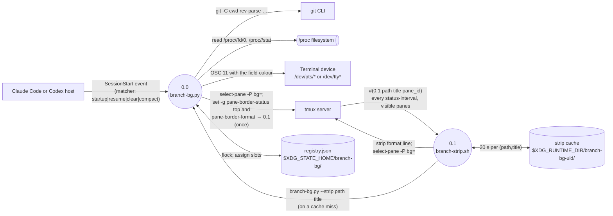

# denubis-hook-branch-bg — Context (Level 0)

> System boundary: a Python script and a small shell helper that colour tmux panes and
> the terminal by person, repo, branch and session. tmux draws a four-block title strip
> for every pane from the pane's own path and title; the SessionStart hook paints the
> field and installs the strip into the running server once.

## Diagram

```mermaid
flowchart LR
    CC[Claude Code or Codex host]
    Tmux[tmux server]
    Git[git CLI]
    Proc@{ shape: das, label: "/proc filesystem" }
    TTY[Terminal device\n/dev/pts/* or /dev/tty*]
    Reg@{ shape: cyl, label: "registry.json\n$XDG_STATE_HOME/branch-bg/" }
    Cache@{ shape: cyl, label: "strip cache\n$XDG_RUNTIME_DIR/branch-bg-uid/" }

    Hook((0.0\nbranch-bg.py))
    Strip((0.1\nbranch-strip.sh))

    CC -->|"SessionStart event\n(matcher: startup|resume|clear|compact)"| Hook
    Hook -->|"git -C cwd rev-parse …"| Git
    Hook -->|"read /proc/<pid>/fd/0, /proc/<pid>/stat"| Proc
    Hook -->|"OSC 11 with the field colour"| TTY
    Hook -->|"select-pane -P bg=<field>;\nset -g pane-border-status top and\npane-border-format → 0.1 (once)"| Tmux
    Hook <-->|"flock; assign slots"| Reg
    Tmux -->|"#(0.1 path title pane_id)\nevery status-interval, visible panes"| Strip
    Strip <-->|"20 s per (path,title)"| Cache
    Strip -->|"branch-bg.py --strip path title\n(on a cache miss)"| Hook
    Strip -->|"strip format line;\nselect-pane -P bg=<field>"| Tmux
```

## External Entities

| Entity | Description | Inputs to System | Outputs from System |
|--------|-------------|------------------|---------------------|
| Agent host | Claude Code or Codex emits `SessionStart`. | The event; the script reads nothing from its payload | No stdout on ordinary success (`branch-bg.py::apply_session_start`) |
| tmux server | Draws the strip; receives pane and global option commands. | `show-options -gv pane-border-format`; `select-pane -t <pane> -P bg=…`; `set-option -g pane-border-status top`; `set-option -g pane-border-format '#(bash …/branch-strip.sh #{q:pane_current_path} #{q:pane_title} #{pane_id})'` (`branch-bg.py::ensure_tmux_strip`, 0.3.0) | Runs `branch-strip.sh` per visible pane each `status-interval` and renders its one-line answer as the pane's title strip |
| git CLI | Repo identity and branch for a path. | `git -C <path> rev-parse --git-common-dir` / `--abbrev-ref HEAD` (`branch-bg.py::git_identity`) | Common dir (made absolute and real); branch |
| `/proc` filesystem | Finds the controlling terminal for OSC 11. | `readlink /proc/<pid>/fd/0`; `/proc/<pid>/stat` (`branch-bg.py::find_terminal`) | FD target; parent PID |
| Terminal device | Receives `\033]11;#RRGGBB\007` (`branch-bg.py::set_terminal_bg`). | The field colour | (none) |
| Registry file | `$XDG_STATE_HOME/branch-bg/registry.json` (default `~/.local/state/…`; override `BRANCH_BG_REGISTRY`), sibling `.lock` via `flock`. | Prior `kinds.{person,repo,branch}.<name> = {slot, seen}` (`branch-bg.py::assign`, `_assign_slot`) | Atomically rewritten assignments |
| Strip cache | `$XDG_RUNTIME_DIR/branch-bg-<uid>/<md5(path,title)>`, TTL `BRANCH_BG_STRIP_TTL` (20 s). | Cached two-line answers | Fresh answers on a miss |

## System Boundary

**In scope:**
- One table of 40 block colours with their black-or-white label colour (`branch-bg.py::BLOCKS`), produced by `docs/branch-bg-colour-eval.py --text-flip --ratio 4.5 --repo-gap 5 --max-chroma 0.16 --min-lightness 0.30 --emit-blocks`, in farthest-point order.
- Reading a pane: person = directory under a `people/` path segment (`person_of`); repo = git common dir, displayed by its directory name (`repo_name`); branch; session = Claude's `✳ <name>` or the fourth ` | ` field of Codex's title (`session_of`); place = first directory under home or a short path prefix (`place_of`).
- Pinned colours: `main` and `master` are always `#ff0000` with black text and take no registry slot (`branch-bg.py::PINNED`, `block_colour`).
- Assigning colours: person, repo and branch through the registry (lowest free slot from a per-kind offset; least-recently-seen slot reused when the table is full; hash fallback when the registry is unusable); session and place by hash, a session stepping past any block already on its strip (`assign`).
- Drawing: the strip format `#[bg=…,fg=…,bold] label ` per known block, `#` escaped (`strip_format`); the field as an 80% shade toward black of the repo colour, else person, else place (`field_for`, `shade`).
- Installing the strip into the running tmux server once per server, and only when `pane-border-format` is unset or already names `branch-strip.sh` (`ensure_tmux_strip`).

**Out of scope:**
- Restoring prior terminal colours or tmux options; a hand-set `pane-border-format` is left alone.
- Non-tmux terminals get OSC 11 only.
- Platforms without `/proc`; non-git panes get a derived tint, never an error.
- Perceptual guarantees on a given display: the table's separations are model figures (Oklab and CIEDE2000 JND), not measured.

## Hook Registration

Claude Code: `plugins/denubis-hook-branch-bg/hooks/claude-hooks.json`, `SessionStart`, matcher `startup|resume|clear|compact`, command `uv run --no-project --no-config python "${CLAUDE_PLUGIN_ROOT}/hooks/branch-bg.py"`, timeout 5 s, `suppressOutput: true`. `--no-project --no-config` keeps a malformed `pyproject.toml` in the caller's cwd from wedging `uv` (guarded by `tests/test_hook_launcher_cwd_independence.py`).

Codex: `plugins/denubis-hook-branch-bg/hooks/codex-hooks.json`, `python3 "${PLUGIN_ROOT}/hooks/branch-bg.py"`.

`branch-strip.sh` prefers `uv run --no-project --no-config python` and falls back to `python3`.

## Cross-References

- **Plugin manifests:** `.claude-plugin/plugin.json` and `.codex-plugin/plugin.json`, version 0.3.0.
- **Marketplace entries:** `.claude-plugin/marketplace.json` and `.agents/plugins/marketplace.json`.
- **Design evidence:** `docs/handover-branch-bg-colour.md` (diagnosis, metrics, sources), `docs/branch-bg-colour-eval.py` (generator and evaluation).
- **Related architecture docs:** `../../README.md` (index), `../../glossary.md`, `../../constraints.md`.
- **Sibling hook plugins:** `denubis-hook-gh-fork-guard`, `denubis-hook-pretooluse-dispatcher`.
