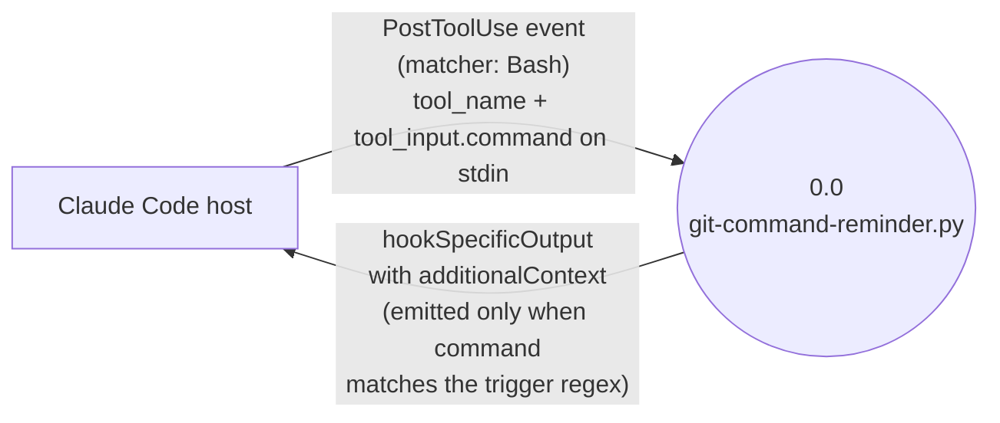

# denubis-hook-claudemd-reminder — Context (Level 0)

> System boundary: a single Python script invoked after every `Bash` tool call that emits a reminder when the call looked like a git review (`git status`, `git log`) other than a short one-liner.

## Diagram

## External Entities

| Entity | Description | Inputs to System | Outputs from System |
|--------|-------------|------------------|---------------------|
| Claude Code host | Emits a `PostToolUse` event after each tool call; conveys the tool name and tool input to the hook on stdin; consumes a JSON response on stdout. | `tool_name` and `tool_input.command` from the JSON payload (`plugins/denubis-hook-claudemd-reminder/hooks/git-command-reminder.py::input_data`, `6b7bd86`) | `hookSpecificOutput` JSON with `hookEventName: "PostToolUse"` and an `additionalContext` reminding to invoke `denubis-extending-claude:project-claude-librarian` before commits (`git-command-reminder.py`, `6b7bd86`) |

## System Boundary

**In scope:**
- Match the executed Bash command against `^git\s+(status|log(?!\s+--oneline\s+-\d+$))` and emit a reminder when it matches. The negative lookahead deliberately ignores short `git log --oneline -N` one-liners (`git-command-reminder.py`, `6b7bd86`).
- Emit nothing when the tool is not `Bash`, when stdin is not valid JSON, or when the command does not match the regex (`git-command-reminder.py`, `6b7bd86`).

**Out of scope:**
- Examining the git output itself — the hook fires on the *command shape* alone, regardless of what `git status` or `git log` actually printed.
- Any tool other than `Bash`.
- Any event other than `PostToolUse`.

## Hook Registration

Registered in `plugins/denubis-hook-claudemd-reminder/hooks/hooks.json` (`22d2148`):

- **Event:** `PostToolUse`
- **Matcher:** `Bash`
- **Command:** `uv run python "${CLAUDE_PLUGIN_ROOT}/hooks/git-command-reminder.py"`
- **Timeout:** 5 seconds
- **suppressOutput:** `true`

## Cross-References

- **Plugin manifest:** `plugins/denubis-hook-claudemd-reminder/hooks/.claude-plugin/plugin.json` (`22d2148`), version 1.1.2.
- **Marketplace entry:** `.claude-plugin/marketplace.json` (`18f3b80`).
- **Related plugin referenced by the reminder text:** `denubis-extending-claude` (the `project-claude-librarian` agent lives there).
- **Shared docs:** `../../README.md`, `../../glossary.md`, `../../constraints.md`.
