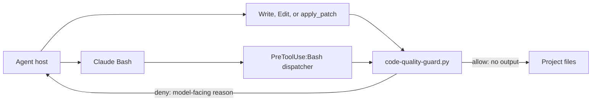

# denubis-hook-code-quality-guard — Context

## Boundary

This plugin owns three `PreToolUse` refusals whose violation is observable in the
proposed tool payload:

- JavaScript injection through `page.evaluate`, `ui.run_javascript`, script tags,
  or init scripts inside E2E, Playwright, or integration tests;
- `metadata.create_all` outside an Alembic version file; and
- Claude Bash heredocs whose `cat`/`tee` stream is directed to a real file,
  bypassing the structured Write/Edit permission and diff surface.

It does not infer intent from TODOs, debug statements, skip markers, or similar
words. It allows normal command output capture, file reads, non-writing heredocs,
bare `tee`, and `tee /dev/null`. Project-native tests, linters, types,
constraints, and review own contextual judgments.

## Contract

Claude Write/Edit uses `hooks/hooks.json`. Claude Bash reaches the same stdlib-only
implementation through the executable `hooks/pretooluse-bash.sh` convention.
Codex `apply_patch` uses `hooks/codex-hooks.json`.

The implementation reads the proposed tool payload from stdin. Malformed input,
unrelated tools, and unmatched writes pass silently. A Claude denial exits 2 and
returns the same explanation in
`hookSpecificOutput.permissionDecisionReason` and top-level `systemMessage`.
Codex returns the model-facing structured denial with exit 0, as required by its
hook boundary.

The hook targets Python 3.9 independently of the repository application's Python
floor. `pyproject.toml` gives every `plugins/*/hooks/*.py` file that formatter
target, and the hook-portability test imports each hook under the floor
interpreter.

## Sources

- Claude Write/Edit registration: `plugins/denubis-hook-code-quality-guard/hooks/hooks.json`
- Claude Bash dispatcher adapter: `plugins/denubis-hook-code-quality-guard/hooks/pretooluse-bash.sh`
- Codex registration: `plugins/denubis-hook-code-quality-guard/hooks/codex-hooks.json`
- Policy and output: `plugins/denubis-hook-code-quality-guard/hooks/code-quality-guard.py`
- Behavioral checks: `tests/test_code_quality_guard.py`
- Runtime-floor check: `tests/test_hook_portability.py`
