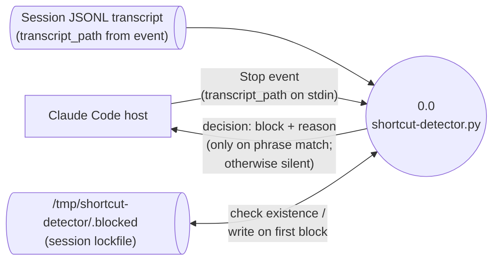

# denubis-hook-shortcut-detection — Context (Level 0)

> System boundary: a Python script registered as the `Stop` hook that scans the session transcript for shortcut phrases in Claude's last assistant message and blocks the stop with an E-STOP message when one is found.

## Diagram

## External Entities

| Entity | Description | Inputs to System | Outputs from System |
|--------|-------------|------------------|---------------------|
| Claude Code host | Emits the `Stop` event when the model would otherwise stop responding. Consumes a `decision: "block"` to keep the turn open with the supplied reason. | `transcript_path` from the event JSON payload (`plugins/denubis-hook-shortcut-detection/hooks/shortcut-detector.py::main`, `22d2148`) | `{ "decision": "block", "reason": ... }` JSON on stdout when a shortcut phrase matches; no output otherwise (`shortcut-detector.py::main`, `22d2148`) |
| Session JSONL transcript | The file at `transcript_path`. Walked line-by-line to extract the last `type: "assistant"` message's text parts. | Concatenated `text` parts from the last assistant entry (`shortcut-detector.py::get_last_assistant_content`, `22d2148`) | (none — read-only) |
| Session lockfile | `/tmp/shortcut-detector/<sha256(transcript_path)[:16]>.blocked` (via `tempfile.gettempdir()`). | Existence check on entry (`shortcut-detector.py::lockfile_for_session`, `main`, `22d2148`) | First-block-per-session creates the file containing the matched phrase (`shortcut-detector.py::main`, `22d2148`) |

## System Boundary

**In scope:**
- Walk the transcript JSONL and extract the *last* `assistant` entry's `content[*].text` (or string `content`), joined with spaces (`shortcut-detector.py::get_last_assistant_content`, `22d2148`).
- Match the joined content (case-insensitive) against a fixed list of high-signal phrases (`let me try a different approach`, `simpler approach`, `let's just bail`, `let's bail`, `for simplicity`, `to simplify`, `on second thought`, `actually,? let me`, `streamlined`, `directly rather than`) and medium-signal phrases (`easier to`, `more efficient`, `more straightforward`) (`shortcut-detector.py::HIGH_SIGNAL_PHRASES`, `MEDIUM_SIGNAL_PHRASES`, `22d2148`).
- On first match in a session: emit a `decision: "block"` with an explanatory reason and create the per-session lockfile (`shortcut-detector.py::main`, `22d2148`).
- After lockfile exists, exit silently for the rest of that session — preventing re-blocking on the same trigger (`shortcut-detector.py::main`, `22d2148`).

**Out of scope:**
- Any event other than `Stop` (the script does not check `tool_name` — it relies on Claude Code only invoking it on `Stop`).
- Cross-session memory — the lockfile is keyed by `transcript_path`, so a new session resets the detection (`shortcut-detector.py::lockfile_for_session`, `22d2148`).
- Reading user messages, system prompts, or tool results from the transcript — only the last `assistant`-type entry is consulted.
- Heuristics beyond the fixed phrase list — there is no scoring or context-sensitive analysis.

## Hook Registration

Registered in `plugins/denubis-hook-shortcut-detection/hooks/hooks.json` (`22d2148`):

- **Event:** `Stop`
- **Matcher:** none (fires on every `Stop`)
- **Command:** `uv run python "${CLAUDE_PLUGIN_ROOT}/hooks/shortcut-detector.py"`
- **Timeout:** 10 seconds
- **suppressOutput:** `true`

## Cross-References

- **Plugin manifest:** `plugins/denubis-hook-shortcut-detection/hooks/.claude-plugin/plugin.json` (`22d2148`), version 2.0.3.
- **Marketplace entry:** `.claude-plugin/marketplace.json` (`18f3b80`).
- **README:** `plugins/denubis-hook-shortcut-detection/README.md`.
- **Shared docs:** `../../README.md`, `../../glossary.md`, `../../constraints.md`.
