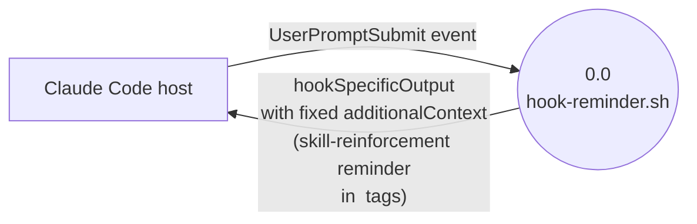

# denubis-hook-skill-reinforcement — Context (Level 0)

> System boundary: a single bash script registered as the `UserPromptSubmit` hook that emits a fixed `additionalContext` reminding the model to consider activating relevant skills before responding.

## Diagram

## External Entities

| Entity | Description | Inputs to System | Outputs from System |
|--------|-------------|------------------|---------------------|
| Claude Code host | Emits a `UserPromptSubmit` event before forwarding each user prompt to the model. Consumes the hook's `additionalContext`, which is prepended to the model's context for this turn. | Event triggers the script; stdin is not read in the body (`plugins/denubis-hook-skill-reinforcement/hooks/hook-reminder.sh`, `e947de8`) | `hookSpecificOutput` JSON with `hookEventName: "UserPromptSubmit"` and a fixed multi-line `additionalContext` string in `<EXTREMELY_IMPORTANT>` tags telling the model to invoke any applicable skill before responding (`hook-reminder.sh`, `e947de8`) |

## System Boundary

**In scope:**
- Emit the fixed JSON object on stdout, every `UserPromptSubmit` event, unconditionally (`hook-reminder.sh`, `e947de8`).

**Out of scope:**
- Inspecting the user's prompt content — the reminder is emitted regardless.
- Tracking session state — no lockfile, no skipping on repeated invocations.
- Listing the actually-available skills — the reminder text directs the model to its system context for that list.
- Any event other than `UserPromptSubmit`.

## Hook Registration

Registered in `plugins/denubis-hook-skill-reinforcement/hooks/hooks.json` (`a8dad2c`):

- **Event:** `UserPromptSubmit`
- **Matcher:** none (fires on every `UserPromptSubmit`)
- **Command:** `${CLAUDE_PLUGIN_ROOT}/hooks/hook-reminder.sh`
- **suppressOutput:** `true`

## Cross-References

- **Plugin manifest:** `plugins/denubis-hook-skill-reinforcement/hooks/.claude-plugin/plugin.json` (`6eb8e31`), version 1.1.0.
- **Marketplace entry:** `.claude-plugin/marketplace.json` (`18f3b80`).
- **README:** `plugins/denubis-hook-skill-reinforcement/README.md`.
- **Shared docs:** `../../README.md`, `../../glossary.md`, `../../constraints.md`.
