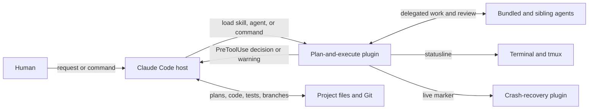

# denubis-plan-and-execute — Context (Level 0)

> System boundary: the design, implementation, verification, and branch-lifecycle
> procedures; the agents they delegate to; two Claude Code hook programs; the
> workflow statusline; and the Claude wrapper.

## Context

## What the plugin ships

| Component | Current surface | Responsibility |
|---|---:|---|
| Skills | 34 | Design discovery, planning, implementation discipline, review, verification, Git lifecycle, and supporting procedures (`plugins/denubis-plan-and-execute/skills/`, `c6882d2`). |
| Agents | 10 | Implementation, bug fixing, review, coherence, database review, proleptic challenge, refactoring, smell assessment, and test analysis (`plugins/denubis-plan-and-execute/agents/`, `c6882d2`). |
| Commands | 2 | `/flesh-it-out` and `/how-to-customize` are thin command entry points (`plugins/denubis-plan-and-execute/commands/`, `c6882d2`). |
| Hook programs | 2 | Live-transcript marker update and pre-write quality guard (`plugins/denubis-plan-and-execute/hooks/hooks.json`). |
| Statusline | 1 package | Renders branch, context, rate-limit, and active-workflow state for the Claude Code statusline (`plugins/denubis-plan-and-execute/scripts/workflow_statusline/pyproject.toml`, `898504f`). |
| Wrapper | 1 script | Starts Claude with the configured tool restrictions and team mode, and maintains liveness state consumed by crash recovery (`plugins/denubis-plan-and-execute/scripts/claude-wrapper.sh`, `8cd6825`). |

## Skill groups

| Group | Skills |
|---|---|
| Workflow entry and lifecycle | `using-plan-and-execute`, `starting-a-design-plan`, `starting-an-implementation-plan`, `executing-an-implementation-plan`, `finishing-a-development-branch` |
| Design and architecture | `brainstorming`, `design-clarify`, `design-write`, `impl-plan-write`, `proleptic-challenge`, `maintain-architecture`, `architecture-update` |
| Coding and debugging | `coding-tdd`, `coding-effectively`, `coding-fcis`, `coding-good-tests`, `coding-property-testing`, `coding-python-idioms`, `coding-verify`, `defense-in-depth`, `systematic-debugging`, `howto-develop-with-postgres` |
| Review and acceptance | `requesting-code-review`, `critical-peer-review`, `exec-coherence-review`, `exec-uat-gate`, `exec-refactoring-rubric` |
| Git lifecycle | `using-git-worktrees`, `make-pr`, `merge-to-main` |
| Supporting procedures | `controlled-dependency-upgrade`, `exec-session-naming`, `restate-our-assumptions`, `using-code-search` |

The grouping is an index over the 34 source directories at `c6882d2`; the individual
skill bodies own their entry and exit contracts.

Implementation planning and execution inspect the repository directly by default.
Delegated agents and review skills are optional bounded tools, not mandatory transition
stages. Tests, operational commands, and irreducible human UAT own completion evidence.
Design follows the same boundary: direct clarification and inspection are normal,
proleptic challenge is targeted to a named uncertainty, and design writing causes no Git
or GitHub side effect.

## Hook boundaries

| Program | Event | Current effect |
|---|---|---|
| `update-live-marker.py` | `SessionStart`, matcher `startup|resume|clear|compact` | Updates the wrapper's live marker with the current transcript identity when the wrapper supplied `CR_LIVE_FILE` (`plugins/denubis-plan-and-execute/hooks/update-live-marker.py`, `5412160`). |
| `code-quality-guard.py` | `PreToolUse:Write|Edit` | Returns deny or advisory output for selected banned write patterns (`plugins/denubis-plan-and-execute/hooks/code-quality-guard.py`, `2f8be5c`). |

The live-marker updater performs a side effect. The quality guard controls only patterns
implemented in its checks and only at its registered write boundary. Workflow procedures
and the two task-entry gates remain in skills and are not repeated at SessionStart.

## External boundaries and failure modes

- The human owns decisions, acceptance, and commits. Skills and agents propose or carry
  out work within that authority.
- Project files and Git hold plans, implementation, tests, and history. A skill's report
  that work was completed is not a repository result.
- Sibling agent plugins supply optional delegated workers. Their availability and model
  tier are deployment concerns outside this plugin's source boundary and do not block
  direct execution.
- The wrapper writes liveness evidence; `denubis-crash-recovery` interprets it. Either
  side can drift independently, so their file contract is cross-plugin.
- The statusline displays observed state. It is not an execution gate.
- SessionStart owns transcript-marker maintenance only; ordinary success supplies no
  workflow prose to the model.

## Cross-references

- **Plugin manifest:** `plugins/denubis-plan-and-execute/.claude-plugin/plugin.json`,
  version 4.0.0.
- **Crash recovery:** [`../denubis-crash-recovery/0-context.md`](../denubis-crash-recovery/0-context.md).
- **Cross-cutting instruction control:** [`../../instruction-control/0-context.md`](../../instruction-control/0-context.md).
- **Shared constraints:** [`../../constraints.md`](../../constraints.md).
