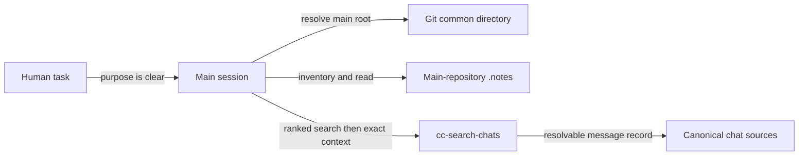

# denubis-project-notes — Context (Level 0)

> System boundary: a task-entry skill that makes the main session retrieve project-owned
> memory and relevant prior chats directly, without a SessionStart request or advisor.

## Context

## Current contracts

| Boundary | Contract | Evidence |
|---|---|---|
| Repository resolution | Resolve the main repository from `git rev-parse --git-common-dir`, so a worktree reads the main checkout's `.notes/`; outside Git, use the current project root. | `plugins/denubis-project-notes/skills/scanning-project-notes/SKILL.md::Resolve the notes universe` |
| Complete inventory | List Markdown notes with hidden and ignored paths included, record the count, and read every note's frontmatter before selecting relevant bodies. | `plugins/denubis-project-notes/skills/scanning-project-notes/SKILL.md::Read before selecting` |
| Direct execution | The main session performs retrieval. The plugin ships no hook and no advisor. | `tests/test_instruction_delivery.py::test_project_notes_retrieval_is_direct_main_agent_work` |
| Chat retrieval | Use several ranked searches for discovery, then open a relevant full message identifier through the exact context resolver. | `plugins/denubis-project-notes/skills/scanning-project-notes/SKILL.md::Search prior chats` |
| Reference integrity | A relied-on pointer must resolve to its source; a missing, ambiguous, stale, or wrong-role reference blocks the dependent action until repaired. | `plugins/denubis-project-notes/skills/scanning-project-notes/SKILL.md::Check reference integrity` |
| Durable writes | Retrieving a fact does not itself authorise a note write. Durable project memory is written only after the user agrees to the wording. | `plugins/denubis-project-notes/skills/scanning-project-notes/SKILL.md::Use the result` |

## Boundary and failure modes

- The skill supplies a procedure, not a mechanical guarantee that the model understood
  project memory.
- A complete frontmatter read proves inventory coverage, not relevance or correctness.
- Ranked chat search supplies candidates. Exact resolution supplies the source record.
- An empty search result is bounded by the sources and query the command actually reached.
- Notes preserve memory; they do not create human authority or executable policy.

## Cross-references

- **Plugin manifest:** `plugins/denubis-project-notes/.claude-plugin/plugin.json`, version
  0.1.0.
- **Cross-cutting instruction control:**
  [`../../instruction-control/0-context.md`](../../instruction-control/0-context.md).
- **Decision on source pointers:**
  [`../../decisions/0004-advisors-cite-by-openable-pinpoint-only.md`](../../decisions/0004-advisors-cite-by-openable-pinpoint-only.md).
