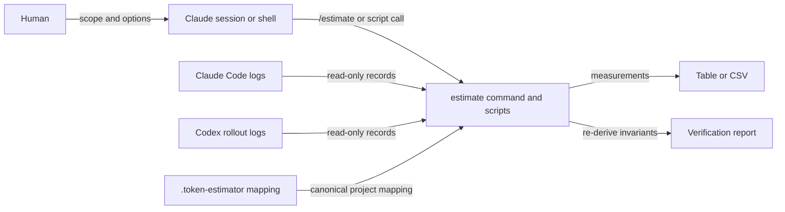

# denubis-token-estimator — Context (Level 0)

> System boundary: read-only analysis of Claude Code and Codex logs to measure model
> output tokens and human-authored input words for AI-use disclosure.

## Context

## Current contracts

| Boundary | Contract | Evidence |
|---|---|---|
| Measures | Report model output tokens and human-authored input words as different units; split output between main thread and subagent work. | `plugins/denubis-token-estimator/skills/using-token-estimator/SKILL.md::The two measures`, `fb92d59` |
| Claude output | Deduplicate replayed Claude messages by origin before classifying main versus subagent output. | `plugins/denubis-token-estimator/skills/using-token-estimator/SKILL.md::Methodology in one screen`, `fb92d59` |
| Codex output | Treat each rollout as one thread and use its cumulative output counter; do not merge independent subagent counters into the parent. | `plugins/denubis-token-estimator/skills/using-token-estimator/SKILL.md::Methodology in one screen`, `fb92d59` |
| Human input | Strip named machine wrappers while retaining human-pasted content. | `plugins/denubis-token-estimator/skills/using-token-estimator/SKILL.md::Methodology in one screen`, `fb92d59` |
| Attribution | Use `.token-estimator` longest-prefix mappings to preserve project identity across directory moves. | `plugins/denubis-token-estimator/skills/using-token-estimator/SKILL.md::Configuration and the mapper`, `fb92d59` |
| Verification | Re-derive headline figures and structural invariants from live logs rather than accepting a report's self-description. | `plugins/denubis-token-estimator/scripts/verify.py`, `7b1b4a4` |

## What the plugin ships

- `/estimate`, a Bash-enabled command that selects project, person, all-project, monthly,
  and CSV scopes (`plugins/denubis-token-estimator/commands/estimate.md`, `fb92d59`).
- `using-token-estimator`, the methodology and operating procedure
  (`plugins/denubis-token-estimator/skills/using-token-estimator/SKILL.md`, `fb92d59`).
- `estimate.py`, the report engine; `mapper.py`, project identity resolution; and
  `verify.py`, the reproducibility harness (`plugins/denubis-token-estimator/README.md`,
  `7b1b4a4`).

## Boundary and failure modes

- Log reads are non-mutating. Optional CSV output is an explicit user-selected write.
- Missing or moved path mappings fragment attribution without changing the raw logs.
- Claude and Codex store different counters and thread relationships; applying one
  vendor's rule to the other yields wrong totals.
- The methodology is marked WIP and externally unaudited. A successful internal
  re-derivation establishes reproducibility, not independent validity.
- This plugin counts records. It does not search or render session content.

## Cross-references

- **Plugin manifest:** `plugins/denubis-token-estimator/.claude-plugin/plugin.json`,
  version 0.1.0 (`fb92d59`).
- **Design and audit brief:** `plugins/denubis-token-estimator/docs/DESIGN.md` and
  `plugins/denubis-token-estimator/docs/AUDIT-BRIEF.md` (`7b1b4a4`).
- **Cross-cutting instruction control:** [`../../instruction-control/0-context.md`](../../instruction-control/0-context.md).
