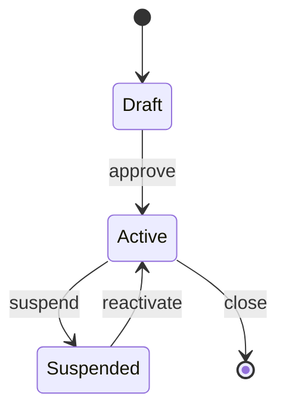

# Architecture Documentation System Design

**GitHub Issue:** None

## Summary

This work adds a `maintain-documentation` skill (split into an inner skill `update-architecture-docs` and a user-invocable wrapper `maintain-architecture`) to the `denubis-plan-and-execute` plugin. The goal is to keep a structured `docs/architecture/` directory — containing data flow diagrams, entity state diagrams, database docs, personae, a glossary, and measurable quality constraints — in sync with the actual codebase over time. Rather than manually editing these files, the system reads design plans or git diffs, detects which architecture documents are affected, checks for contradictions between the proposed changes and existing docs, and presents proposals to the human for approval before writing anything.

The approach follows patterns already established in the plugin: a user-facing wrapper orchestrates the session (scoping the diff, dispatching subagents to read code, and asking one targeted question at a time), while the inner skill does the structured analysis and write operations. The inner skill is also wired into the existing design-plan workflow so that architecture docs are proposed and approved as part of every design plan commit. As a housekeeping step, three existing skills that currently reference `docs/database.md` are updated to reference the new canonical path `docs/architecture/database.md`.

## Definition of Done
A `maintain-documentation` skill exists in the `denubis-plan-and-execute` plugin with two modes. In **sub-skill mode**, design/implementation skills call it to propose architecture documentation changes, which are presented to the human for approval before writing. In **standalone mode**, it runs interactive maintenance sessions — dispatching sonnet subagents to read code, asking one pointed question at a time to fill gaps or resolve conflicts between docs and reality.

A `docs/architecture/` directory convention is defined with templates for: hierarchically-numbered DFD files (Yourdon/DeMarco), database documentation (migrated from `docs/database.md`), personae, project glossary, quality constraints, and entity state/lifecycle diagrams. The skill supports both greenfield creation (first design plan) and bootstrap from an existing codebase.

Existing skills that reference `docs/database.md` (`writing-design-plans`, `dba-reviewer`, `howto-develop-with-postgres`) are updated to use the new `docs/architecture/database.md` path. `dependency-rationale.md` is unchanged.

## Acceptance Criteria

### maintain-arch-docs.AC1: Inner skill proposes architecture doc changes from design plans

- **maintain-arch-docs.AC1.1 Success:** Given a design plan path introducing a new data transformation, the inner skill identifies affected DFD files and proposes additions
- **maintain-arch-docs.AC1.2 Success:** Given a design plan with new database entities, the inner skill proposes updates to `docs/architecture/database.md`
- **maintain-arch-docs.AC1.3 Success:** Given a design plan introducing a new user type, the inner skill proposes additions to `personae.md`
- **maintain-arch-docs.AC1.4 Success:** Given a design plan with new domain terms, the inner skill proposes additions to `glossary.md`
- **maintain-arch-docs.AC1.5 Success:** Proposals are grouped by doc type and presented to the human for approval before writing
- **maintain-arch-docs.AC1.6 Failure:** Given a design plan with no architecture-relevant content (e.g., pure refactor), the inner skill reports "no architecture changes detected" and exits

### maintain-arch-docs.AC2: Inner skill detects contradictions and halts

- **maintain-arch-docs.AC2.1 Success:** When a design plan introduces a process that duplicates responsibilities already assigned in the DFD, the skill HALTs and presents the contradiction
- **maintain-arch-docs.AC2.2 Success:** When a new term definition conflicts with an existing glossary entry, the skill HALTs and presents both definitions
- **maintain-arch-docs.AC2.3 Success:** When a new constraint contradicts an existing one (e.g., "sub-100ms" vs "batch processing acceptable"), the skill HALTs with both constraints
- **maintain-arch-docs.AC2.4 Success:** After HALT, the human can resolve the contradiction and the skill continues with the resolution

### maintain-arch-docs.AC3: Inner skill handles greenfield and bootstrap

- **maintain-arch-docs.AC3.1 Success:** When `docs/architecture/` does not exist, the skill scaffolds the directory structure and creates initial files from the design plan
- **maintain-arch-docs.AC3.2 Success:** Bootstrap creates `0-context-diagram.md` from the design plan's system boundary
- **maintain-arch-docs.AC3.3 Success:** Bootstrap populates initial glossary and personae from design context
- **maintain-arch-docs.AC3.4 Success:** If the project has an existing `docs/database.md`, bootstrap migrates it to `docs/architecture/database.md`

### maintain-arch-docs.AC4: Wrapper skill runs standalone maintenance sessions

- **maintain-arch-docs.AC4.1 Success:** Wrapper computes git diff baseline appropriate to context (branch: merge-base; main: last architecture commit)
- **maintain-arch-docs.AC4.2 Success:** Wrapper dispatches subagents to read code and architecture files, reporting what exists, what changed, and what's missing
- **maintain-arch-docs.AC4.3 Success:** Wrapper asks one pointed question at a time to fill gaps or resolve conflicts
- **maintain-arch-docs.AC4.4 Success:** Wrapper invokes inner skill with diff baseline to propose and apply updates
- **maintain-arch-docs.AC4.5 Edge:** When no changes are detected in the diff, wrapper reports "architecture docs appear current" and exits

### maintain-arch-docs.AC5: Database documentation path migration

- **maintain-arch-docs.AC5.1 Success:** `writing-design-plans` references `docs/architecture/database.md` instead of `docs/database.md`
- **maintain-arch-docs.AC5.2 Success:** `dba-reviewer` references `docs/architecture/database.md` in Step 7
- **maintain-arch-docs.AC5.3 Success:** `howto-develop-with-postgres` references `docs/architecture/database.md` in template and lifecycle sections
- **maintain-arch-docs.AC5.4 Success:** No remaining references to `docs/database.md` exist in the plugin (verified by grep)

### maintain-arch-docs.AC6: Design workflow integration

- **maintain-arch-docs.AC6.1 Success:** `writing-design-plans` calls `update-architecture-docs` after proleptic challenge, before commit (sequence: Dependency Rationale → Proleptic Challenge → Architecture Documentation → Commit)
- **maintain-arch-docs.AC6.2 Success:** Architecture doc changes are included in the design plan commit
- **maintain-arch-docs.AC6.3 Edge:** When `update-architecture-docs` is called but the target project has no `docs/architecture/`, bootstrap mode triggers automatically

## Glossary

- **DFD (Data Flow Diagram)**: A diagram showing how data moves through a system — processes that transform it, external entities that produce or consume it, and data stores that hold it. This project uses Yourdon/DeMarco notation.
- **Yourdon/DeMarco notation**: A specific DFD visual vocabulary: processes as circles, external entities as rectangles, data stores as open-ended horizontal bars. Named after Ed Yourdon and Tom DeMarco.
- **Context diagram**: The level-0 DFD showing the system as a single process with its external entities and data flows. Defines the system boundary.
- **ERD (Entity-Relationship Diagram)**: A diagram showing database tables, their fields, and the relationships between them. Used in `database.md`.
- **Personae**: Structured descriptions of distinct user types — their goals, access patterns, and constraints. Similar to UX personas but used here for access control and design scoping.
- **Ubiquitous language**: A shared vocabulary, used consistently across code, docs, and conversation, so that a term means the same thing everywhere. The glossary enforces this.
- **Mermaid**: A markdown-compatible diagramming syntax that renders diagrams from plain text. Used for DFDs, state diagrams, and ERDs in this project.
- **`stateDiagram-v2`**: The Mermaid diagram type for state machines; shows entity states and the transitions between them.
- **Bootstrap mode**: The skill's behaviour when `docs/architecture/` does not yet exist — it scaffolds the directory and creates initial files from whatever context is available.
- **Greenfield mode**: The variant of bootstrap mode for a project starting from scratch (first design plan, no existing code or docs).
- **HALT**: An explicit stop in the skill's flow when a contradiction is detected. The skill surfaces the conflict to the human and waits for resolution before continuing.
- **Inner skill / sub-skill**: A skill with `user-invocable: false` — it can only be called by another skill, not directly by the user. Used here for `update-architecture-docs`.
- **Wrapper skill**: A user-invocable skill that orchestrates a workflow by calling inner skills and subagents.
- **Subagent**: A separate Claude agent instance dispatched by a skill to do bounded, focused work (e.g., reading files) without polluting the orchestrator's context window.
- **Git merge-base**: The most recent common ancestor commit between two branches. Used here to compute the diff scope when working on a feature branch.
- **Atomic unit**: The smallest meaningful piece of a given doc type — e.g., a single process in a DFD, a single term in the glossary — used to make contradiction detection and proposal grouping tractable.
- **Context signal**: A cue extracted from a design plan or diff that indicates a particular doc type needs updating (e.g., a new database entity signals that `database.md` needs updating).
- **Contradiction pattern**: A defined category of conflict between a proposed change and existing architecture docs that the skill is trained to detect before proposing writes.
- **`docs/dependency-rationale.md`**: An existing file in the plugin's convention that records why each third-party package was chosen. Explicitly excluded from the new `docs/architecture/` structure.
- **`denubis-plan-and-execute`**: The plugin within this repository that houses design-plan and code-review skills. The new skills are added to it.

## Architecture

Two skills in `denubis-plan-and-execute`: a wrapper and an inner skill.

**`update-architecture-docs`** (inner skill, `user-invocable: false`) receives a concrete artifact and proposes changes to `docs/architecture/`. In sub-skill mode, it receives a design plan file path. In wrapper mode, it receives a git diff baseline (the wrapper runs `git diff` and passes the output, not a SHA — the diff may include uncommitted work). It reads current architecture docs, identifies what the artifact affects, checks for contradictions, and presents proposals to the human for approval. It never operates on conversation context alone.

**`maintain-architecture`** (wrapper skill, `user-invocable: true`) orchestrates standalone maintenance sessions. It computes the git diff baseline, dispatches sonnet subagents to read code and architecture files, asks one pointed question at a time to fill gaps or resolve conflicts, then calls `update-architecture-docs` with its findings. This follows the `starting-a-design-plan` → `writing-design-plans` orchestrator pattern.

### Directory Convention

Target projects maintain a `docs/architecture/` directory:

```
docs/architecture/
├── dfd/
│   ├── 0-context-diagram.md        # System boundary, external entities
│   ├── 1-subsystem-name.md         # Level 1 decomposition
│   ├── 1.1-process-name.md         # Level 2
│   ├── 1.1.1-sub-process.md        # Level 3 (as needed)
│   └── ...
├── states/
│   ├── order.md                    # Order entity lifecycle
│   ├── user-account.md             # Account states
│   └── ...
├── database.md                     # Migrated from docs/database.md
├── personae.md                     # User types, goals, constraints
├── glossary.md                     # Project ubiquitous language
└── constraints.md                  # Measurable quality limits
```

Each DFD file is standalone: one per context level, numbered hierarchically (0, 1, 1.1, 1.1.1). Every file contains its Mermaid diagram, prose description, inputs/outputs, and cross-references to parent/child processes, commits, and issues. Nothing is inlined — each process at every level gets its own file.

**Numbering stability:** DFD numbers are stable identifiers — once assigned, a process keeps its number. New processes get the next available number at their level. Gaps are acceptable. The `maintain-architecture` wrapper can propose a periodic renumbering pass during standalone sessions when gaps become confusing, but renumbering is never automatic.

### Inner Skill: Input and Flow

The inner skill accepts one of two input types:

| Mode | Input | When |
|------|-------|------|
| Sub-skill | Design plan file path | Called by `writing-design-plans` after body is written |
| Wrapper | Git diff output (from baseline) | Called by `maintain-architecture` during maintenance |

**Flow:**

1. **Read current state** — load all files under `docs/architecture/`. If directory doesn't exist, enter bootstrap mode.
2. **Parse artifact** — extract entities, processes, data flows, constraints, and terms from the design plan or diff.
3. **Detect contradictions** — compare extracted content against existing docs. If a contradiction is found, **HALT**: present the contradiction to the human with both the new and existing content, and wait for resolution. The human chooses to update the existing doc, revise the design, or acknowledge the divergence. The skill continues from step 4 only after resolution. Finding contradictions is more important than updating. Example: design plan introduces a `PaymentService` that duplicates responsibilities already assigned to `BillingService` in the DFD.
4. **Identify affected docs** — determine which files need creation or modification, organised by doc type.
5. **Propose changes** — present each proposed change to the human for approval before writing. Group by doc type. Never write blind updates.
6. **Write approved changes** — apply approved proposals using templates.

**Bootstrap mode** (no `docs/architecture/` exists): scaffold the directory, create `0-context-diagram.md` from the design plan's system boundary, populate initial glossary and personae from design context.

**Greenfield mode** (first design plan for a new project): same as bootstrap but also creates `database.md` from the design plan's database section if present.

### Assessment Framework

Each doc type has defined atomic units, context signals for when it needs updating, and contradiction patterns:

| Doc Type | Atomic Unit | Context Signal | Contradiction Pattern |
|----------|-------------|----------------|----------------------|
| DFD | Process (numbered) | New data transformation, renamed component, changed data flow | Process duplicates existing responsibility; data flow contradicts existing diagram |
| Database | Table/relationship | New entity, changed schema, new FK | Entity in design doesn't match existing ERD; relationship contradicts existing constraints |
| Personae | User type | New actor, changed access pattern | New persona overlaps existing one; access pattern contradicts constraints |
| Glossary | Term | New domain concept, renamed entity | Term defined differently than existing entry; synonym collision |
| Constraints | Quality attribute | New SLA, performance target, capacity requirement | New constraint contradicts existing one (e.g., "sub-100ms" vs existing "batch is fine") |
| States | Entity lifecycle | New status, state transition, terminal state | State transition contradicts existing lifecycle; new state unreachable from existing graph |

### Context Detection via Git Diff

The wrapper skill computes diff baselines to scope maintenance sessions:

| Context | Baseline Command | Scope |
|---------|-----------------|-------|
| On a branch | `git merge-base HEAD main` | All changes since branch diverged |
| On main | `git log -1 --format=%H -- docs/architecture/` | Changes since last architecture update |

The wrapper dispatches sonnet subagents with the diff to read affected files and report what changed. This keeps the wrapper's context clean — subagents do the heavy reading, the wrapper asks questions and orchestrates.

### Wrapper Skill: Standalone Sessions

The wrapper orchestrates interactive maintenance:

1. **Determine scope** — is this a targeted review (specific files/features) or a full sweep?
2. **Compute baseline** — git diff from appropriate baseline.
3. **Investigate** — dispatch subagents to read code files and current architecture docs. Subagents report: what exists, what changed, what's missing.
4. **Question loop** — ask one pointed, specific question at a time to fill gaps or resolve conflicts between docs and reality. Use AskUserQuestion for choices, open-ended for understanding.
5. **Call inner skill** — once changes are understood, invoke `update-architecture-docs` with the diff baseline to propose and apply updates.
6. **Repeat or finish** — if more doc types need attention, loop. Otherwise, summarise what was updated.

### Mermaid Conventions

Architecture docs use Mermaid diagrams with consistent conventions.

**DFD diagrams** use `flowchart` with Yourdon/DeMarco notation:

| Element | Mermaid Syntax | Example |
|---------|---------------|---------|
| Process | `(( ))` (double circle) | `P1((1.0\nProcess Name))` |
| External entity | `[ ]` (rectangle) | `E1[External System]` |
| Data store | `@{ shape: das }` | `D1@{ shape: das, label: "Store Name" }` |
| Data flow | `-->` with label | `E1 -->|"request data"| P1` |

Requires Mermaid v11.3.0+ for `@{ shape: das }` syntax.

**State diagrams** use `stateDiagram-v2`:



**ERD diagrams** in `database.md` use `erDiagram` (existing convention from `howto-develop-with-postgres`).

### Migration and Integration

**Database documentation migration:**
- Move `docs/database.md` → `docs/architecture/database.md`
- Content and format unchanged — same six sections (Universe of Discourse, ERD, DFDs, Data Dictionary, Design Decisions, Denormalisation Register)

**Skill updates for new path:**
- `writing-design-plans` — update "Before Commit: Database Documentation" section to reference `docs/architecture/database.md`
- `dba-reviewer` — update Step 7 to reference `docs/architecture/database.md`
- `howto-develop-with-postgres` — update template references and lifecycle table

**Integration with design workflow:**
- `writing-design-plans` gains a new "Before Commit: Architecture Documentation" step that calls `update-architecture-docs` with the design plan file path
- This step runs **after** proleptic challenge (only document designs that survived challenge). Updated sequence: Dependency Rationale → Proleptic Challenge → Architecture Documentation → Commit
- The existing "Before Commit: Database Documentation" section is removed — database.md is now handled by `update-architecture-docs` as part of its broader scope
- The inner skill handles detection of what needs updating — calling skills don't need to know which doc types are affected

**Unchanged:** `docs/dependency-rationale.md` stays where it is. It serves a different purpose (audit trail for packages) and doesn't belong in architecture docs.

## Existing Patterns

**Wrapper → inner skill orchestration** follows `starting-a-design-plan` → `writing-design-plans` exactly. The wrapper is `user-invocable: true`, announces the inner skill, and delegates structured work. Found at `plugins/denubis-plan-and-execute/skills/starting-a-design-plan/SKILL.md`.

**Keyword-based detection** for conditional sub-skill dispatch matches `writing-design-plans`' database documentation trigger (scan Architecture/Implementation Phases for `tables`, `models`, `schema`, etc.). Found at `plugins/denubis-plan-and-execute/skills/writing-design-plans/SKILL.md` line 641.

**Git diff as operating artifact** follows the `requesting-code-review` → `code-reviewer` pattern. The orchestrator computes SHA ranges via bash, passes them into the sub-skill/agent prompt as template tokens. Found at `plugins/denubis-plan-and-execute/skills/requesting-code-review/`.

**Prompt template alongside SKILL.md** follows `requesting-code-review/code-reviewer.md`. The inner skill may include template files for each doc type in its skill directory.

**HALT on missing docs** follows `dba-reviewer`'s pattern of halting when `docs/database.md` doesn't exist during schema review. Found at `agents/dba-reviewer.md` line 111.

**No existing architecture documentation skill.** Investigation confirmed no skill currently manages DFDs, personae, glossary, constraints, or state diagrams. Database documentation is the only structured doc type, managed ad-hoc by three skills.

## Implementation Phases

<!-- START_PHASE_1 -->
### Phase 1: Directory Convention and Document Templates

**Goal:** Define the `docs/architecture/` structure and provide templates for each doc type within the plugin's skill directory.

**Components:**
- Template files in `plugins/denubis-plan-and-execute/skills/update-architecture-docs/templates/` — one per doc type (context-diagram, dfd-process, database, personae, glossary, constraints, state)
- Mermaid diagram conventions documented in each template
- Hierarchical DFD numbering scheme with cross-reference format

**Dependencies:** None (first phase)

**Done when:** Templates exist for all six doc types plus the DFD context diagram, each with correct Mermaid syntax and placeholder content.
<!-- END_PHASE_1 -->

<!-- START_PHASE_2 -->
### Phase 2: Inner Skill — `update-architecture-docs`

**Goal:** Create the inner skill that reads architecture docs, detects contradictions, and proposes changes for human approval.

**Components:**
- `plugins/denubis-plan-and-execute/skills/update-architecture-docs/SKILL.md` — assessment framework, contradiction detection, proposal generation, bootstrap/greenfield modes
- Assessment framework covering all six doc types with atomic units, context signals, and contradiction patterns
- HALT-on-contradiction logic with clear human-facing messages
- Approval flow: present grouped proposals, write only approved changes

**Dependencies:** Phase 1 (templates)

**ACs covered:** `maintain-arch-docs.AC1.*`, `maintain-arch-docs.AC2.*`, `maintain-arch-docs.AC3.*`

**Done when:** Inner skill can receive a design plan path, identify affected architecture docs, detect contradictions, and propose changes with human approval gate. Tests verify contradiction detection and proposal grouping.
<!-- END_PHASE_2 -->

<!-- START_PHASE_3 -->
### Phase 3: Wrapper Skill — `maintain-architecture`

**Goal:** Create the user-invocable wrapper that orchestrates standalone maintenance sessions.

**Components:**
- `plugins/denubis-plan-and-execute/skills/maintain-architecture/SKILL.md` — scope determination, git diff baseline computation, subagent dispatch, question-driven flow, inner skill invocation
- Workflow status line integration (breadcrumb updates at transitions)

**Dependencies:** Phase 2 (inner skill)

**ACs covered:** `maintain-arch-docs.AC4.*`

**Done when:** Wrapper can run standalone sessions — computing diff baselines, dispatching subagents to read code, asking targeted questions, and invoking the inner skill to propose updates.
<!-- END_PHASE_3 -->

<!-- START_PHASE_4 -->
### Phase 4: Migration and Integration

**Goal:** Migrate `docs/database.md` path references and integrate `update-architecture-docs` into the design workflow.

**Components:**
- `plugins/denubis-plan-and-execute/skills/writing-design-plans/SKILL.md` — add "Before Commit: Architecture Documentation" step, update database.md path to `docs/architecture/database.md`
- `plugins/denubis-plan-and-execute/agents/dba-reviewer.md` — update Step 7 path reference
- `plugins/denubis-plan-and-execute/skills/howto-develop-with-postgres/SKILL.md` — update template references and lifecycle table

**Dependencies:** Phase 2 (inner skill exists for integration)

**ACs covered:** `maintain-arch-docs.AC5.*`, `maintain-arch-docs.AC6.*`

**Done when:** All three existing skills reference `docs/architecture/database.md`. `writing-design-plans` calls `update-architecture-docs` after body writing. No remaining references to `docs/database.md` in the plugin.
<!-- END_PHASE_4 -->

## Additional Considerations

**Bootstrap requires a design document.** When `update-architecture-docs` encounters no `docs/architecture/` directory, it enters bootstrap mode — but only if it has a design plan to work from. Bootstrap scaffolds the directory and populates initial docs from the design plan's content (system boundary → context diagram, entities → database.md, actors → personae, terms → glossary). If there is no design document, the project needs brainstorming first — there is nothing to bootstrap from. An existing `docs/database.md` is migrated into the new structure during bootstrap.

**DFD elaboration over time:** DFDs are not written once and frozen. Each design plan that introduces business logic transformations should amend the DFD — either to align it with what will be implemented, or to cross-reference where implementation happened. The inner skill's assessment framework handles this via the "new data transformation" context signal.

**Mermaid version dependency:** The `@{ shape: das }` syntax for data stores requires Mermaid v11.3.0+. If a target project uses an older renderer, the templates should note this. The skill does not enforce Mermaid versions — it documents the requirement and lets the human decide.
