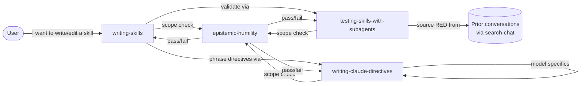

# Skill-Skills Upstream Sync Design

**GitHub Issue:** None

## Summary

This design syncs four skill-authoring skills in the `denubis-extending-claude` plugin against upstream improvements in the obra/superpowers skill library. The work has two moving parts: adopting obra's architectural shape (thin orchestrators that delegate dense material to peer supporting files) and correcting stale or unverifiable content accumulated in earlier sessions (outdated model-specific claims, fabricated taxonomy codes misattributed to an academic paper).

The approach is hybrid. `writing-skills` gets a full cornerstone rewrite as a thin orchestrator that sequences the other two skills. `testing-skills-with-subagents` and `writing-claude-directives` are restructured in place, preserving verified denubis-specific material verbatim while grafting on obra improvements. A new fourth skill, `epistemic-humility`, is authored from scratch as a reference-type skill providing a rubric for whether any proposed skill earns its existence — sourced exclusively from verifiable content in `AbsenceJudgement.tex`. Each orchestrator cross-references this rubric on demand rather than inlining it. Progressive disclosure operates at two levels: across the four skills (orchestrators reference the rubric rather than embedding it) and within each skill (a thin SKILL.md delegates heavy material to peer files that load only when needed).

## Definition of Done

**Late addition (mid-Part-1 meta-finding, 2026-04-17).** While applying `impl-plan-write` to plan Phases 1-5, we discovered that the skill documents three anti-smuggling tests (Decomposition / Reduction / Disagreement at impl-plan-write SKILL.md lines 728-734) but provides no forcing function. A planner can route decisions to UAT entries whose falsification is actually automatable, and the skill's current template does not catch it — enforcement arrives only at `exec-uat-gate` execution, too late. Phase 6 (cross-plugin, in `denubis-plan-and-execute`) converts the rubric into a gate via a template change + one-time collation audit. See Additional Considerations and Phase 6 for the full argument.

Four skill artifacts in `plugins/denubis-extending-claude/skills/` are brought up to date and tuned for Opus 4.7 / Sonnet 4.6 / Haiku 4.5:

- `writing-skills/` — **cornerstone orchestrator rewrite** aligned with obra/superpowers upstream. Thin orchestrator SKILL.md that sequences the other two skills. Adopts obra supporting files (`anthropic-best-practices.md`, `persuasion-principles.md`, `render-graphs.js`, `graphviz-conventions.dot`, `examples/CLAUDE_MD_TESTING.md`) adapted to our repo's conventions.
- `testing-skills-with-subagents/` — **restructure-in-place**. Absorb obra improvements (multi-factor pressure-scenario format, letter-vs-spirit bulletproofing, meta-testing) while preserving denubis-specific strengths verbatim (model-tier guidance, "no blaming the model", flaky-result discipline).
- `writing-claude-directives/` — **restructure-in-place**. Update model-specific notes for Opus 4.7 / Sonnet 4.6 / Haiku 4.5 (sourced from current Anthropic system cards and published guidance). Retire Opus-4.5-specific claims that no longer apply. **Persuasion-principles import dropped** — obra includes a Cialdini/Meincke persuasion-principles.md in their writing-skills/, but denubis does not import it. Persuasion principles are compliance-induction levers that shortcut evaluation; their use in skill authoring contradicts the `epistemic-humility` rubric (Phase 1), Anthropic's 2026-04 dial-back-aggressive-language guidance, and AbsenceJudgement's technoscholasticism critique. See Additional Considerations entry *Persuasion principles do not belong in denubis skills*.
- **NEW:** `epistemic-humility/` — **reference-type skill** sourced from `AbsenceJudgement.tex`. Provides a rubric/checklist for when a skill (or any agent-scaffolded task) is structurally in-scope vs over-reaching. Invoked on demand by the three orchestrators when scope/epistemics questions arise. Cites only what is verifiably in the paper: technoscholasticism; Schön's four reflective-practitioner questions; Jones's scope-lever discipline (90%+ unrescued / bounded-reversible failure / fast-surface human rollback); failure patterns (temporality blindness, scope-confabulation, vibes-based operation, evidence accumulation without evaluation); success conditions (mechanical bounded tasks, heavy scaffolding, human-reserved synthesis).

- **NEW (cross-plugin, Phase 6):** `plugins/denubis-plan-and-execute/skills/impl-plan-write/SKILL.md` gains (a) a template change requiring explicit `**What's automatable:**` / `**What's NOT automatable:**` lines preceding every UAT entry's falsification block, and (b) a one-time collation audit step that runs every entry in `uat-requirements.md` through the three anti-smuggling tests before writing the file. This closes the rubric-vs-gate gap discovered mid-Part-1. Cross-plugin scope is surfaced explicitly rather than smuggled — the broken tool is the one we used to plan the sync, so hardening it closes the loop.

**Theoretical spine (load-bearing, verified against sources):** Popper / Lakatos / Haraway / Carnap philosophy of science; proleptic reasoning (Kudina / Ballsun-Stanton / Alfano 2025); technoscholasticism + Schön's four questions + Jones's scope-lever (all from `AbsenceJudgement.tex` verbatim); Latour's black-box / immutable-mobile framing (Latour 1987, 1999) for Observability grounding in Phase 1. **Obra's Cialdini / Meincke persuasion-principles import is explicitly dropped from denubis — see Additional Considerations and the writing-claude-directives DoD entry.** **Prior handoff cited TEMP/RAND/SCOP/VIBE/FABR and MECH/MTCH/SCAF/BOUN codes — these are not in the paper and are not used.**

Success is observable as: all four skills pass a RED-GREEN-REFACTOR test with subagents per the `testing-skills-with-subagents` methodology; each orchestrator has a committed rubric self-application walk-through with any reflective vulnerabilities surfaced to and acknowledged by the user (see "Rubric self-application is a walk-through with surfaced vulnerabilities, not a pass/fail gate" in Additional Considerations — H4 revision dropped the earlier pass/fail framing); per-skill size targets are distinct — `writing-skills` is a thin orchestrator (≤250 lines; cornerstone rewrite from a 163-line stub), `testing-skills-with-subagents` grows modestly from absorbing obra additions and the conversation-precedent protocol (≤550 lines, up from current 421), `writing-claude-directives` shifts content from stale sections into new supporting files with a modest net delta (≤350 lines, from current 270); supporting files sit at peer level within each skill's directory; model-specific guidance references current (2026-04) Anthropic documentation.

**Explicitly out of scope for Part 1:**
- Other skill-skills (`writing-claude-md-files`, `maintaining-project-context`, `creating-a-plugin`, `creating-an-agent`) — touch only if a cross-reference change forces it.
- The critique skills / agents (Part 3).
- PromptGrimoireTool / MELICA tuning (Part 4).
- A standalone research-synthesis artifact — the research informs the rewrite; it is not itself a deliverable.
- Non-sync refactoring of the three incumbent skills unrelated to upstream alignment.

**Handoff:** The design-plan Phase 6 points at **Part 2's design session**, not an implementation plan. Part 2's design will scope which *other* upstream innovations (beyond skill-skills) to fold into the repo.

## Acceptance Criteria

### skill-skills-upstream-sync.AC1: `writing-skills` cornerstone rewrite
- **skill-skills-upstream-sync.AC1.1 Success:** `plugins/denubis-extending-claude/skills/writing-skills/SKILL.md` exists with valid YAML frontmatter (`name`, `description` fields present)
- **skill-skills-upstream-sync.AC1.2 Success:** SKILL.md line count is ≤ 250 (thin-orchestrator target; small margin over the 200-line target in DR5)
- **skill-skills-upstream-sync.AC1.3 Success:** SKILL.md cross-references `testing-skills-with-subagents`, `writing-claude-directives`, and `epistemic-humility`; each reference resolves to an existing skill directory
- **skill-skills-upstream-sync.AC1.4 Success:** Supporting files exist: `anthropic-best-practices.md`, `render-graphs.js`, `examples/CLAUDE_MD_TESTING.md`
- **skill-skills-upstream-sync.AC1.5 Success:** Obra-imported files preserve attribution (Source line in frontmatter or top of file citing obra/superpowers origin)
- **skill-skills-upstream-sync.AC1.6 Failure:** Commit rejected if any obra-imported file lacks attribution or any cross-reference points at a non-existent skill or file
- **skill-skills-upstream-sync.AC1.7 Edge:** `test-requirements.md` for Phase 4 documents the RED evidence — an independent-session failure transcript (cc-search-chats transcript or user-run fresh-session transcript) plus deficiency-location analysis identifying where in the current `writing-skills/SKILL.md` the failure manifests

### skill-skills-upstream-sync.AC2: `testing-skills-with-subagents` restructure
- **skill-skills-upstream-sync.AC2.1 Success:** SKILL.md's RED phase section begins with the conversation-precedent protocol, cross-referencing `cc-search-chats:search-chat` and specifying the fresh-session (independent-session) fallback where the user runs an executor-drafted prompt in a separate chat session
- **skill-skills-upstream-sync.AC2.2 Success:** Synthetic multi-stressor pressure scenarios are positioned as REFACTOR-phase completeness checks, not primary RED baseline (DR3)
- **skill-skills-upstream-sync.AC2.3 Success:** Model-tier guidance ("RED at production tier, GREEN one tier down"), "No Blaming the Model" principle, and flaky-result discipline all retained (grep-audit against current SKILL.md confirms presence)
- **skill-skills-upstream-sync.AC2.4 Success:** Obra's multi-factor pressure-scenario format absorbed (3+ combined stressors, A/B/C forced choice, concrete options)
- **skill-skills-upstream-sync.AC2.5 Success:** Rubric callback section present, references `epistemic-humility`
- **skill-skills-upstream-sync.AC2.6 Failure:** The specific claim "Haiku follows detailed instructions well but struggles with judgement calls" does not appear verbatim; if the tier-test principle appears, it's framed structurally (weakest tier = strongest clarity test) without the Haiku-specific assertion that contradicts current Anthropic docs
- **skill-skills-upstream-sync.AC2.7 Edge:** `test-requirements.md` for Phase 3 documents the RED evidence (independent-session failure transcript + deficiency analysis)

### skill-skills-upstream-sync.AC3: `writing-claude-directives` restructure
- **skill-skills-upstream-sync.AC3.1 Success:** SKILL.md does not contain a section titled "Opus 4.5: 'Think' Sensitivity" (or equivalent) — stale claim fully removed
- **skill-skills-upstream-sync.AC3.2 Success:** `model-tier-notes.md` exists with separate sections for Opus 4.7, Sonnet 4.6, and Haiku 4.5; each section contains at least one citation URL to 2026 Anthropic documentation
- **skill-skills-upstream-sync.AC3.3 Success:** No `persuasion-principles.md` file is imported into `writing-claude-directives/` (denubis explicitly departs from obra on this point — see Additional Considerations). If the file exists in the skill directory post-merge, Phase 2 has regressed.
- **skill-skills-upstream-sync.AC3.4 Success:** SKILL.md contains NO Cialdini/Meincke/persuasion-principles section. Grep-audit for "Cialdini", "Meincke", "persuasion principles" returns zero hits. The rationale-for-absence is documented in the DR set attached to phase_02.md.
- **skill-skills-upstream-sync.AC3.5 Success:** `graphviz-conventions.dot` reconciled against obra's version; reconciliation result documented in the commit message or phase notes
- **skill-skills-upstream-sync.AC3.6 Success:** Rubric callback section present, references `epistemic-humility`
- **skill-skills-upstream-sync.AC3.7 Failure:** No claim cites Opus 4.5 or Sonnet 4.5 as current (both superseded by Opus 4.7 / Sonnet 4.6); every model-specific claim — in `SKILL.md`, `model-tier-notes.md`, AND `long-running-state-patterns.md` (scope clarified during H6 revision) — has an explicit current model-version anchor (e.g. "Opus 4.7:"). Haiku 4.5 is the current Haiku and remains valid.
- **skill-skills-upstream-sync.AC3.8 Edge:** `test-requirements.md` for Phase 2 documents the RED evidence (independent-session failure transcript + deficiency analysis) and the Anthropic PDF consumption (system card content incorporated into `model-tier-notes.md`)

### skill-skills-upstream-sync.AC4: `epistemic-humility` reference skill
- **skill-skills-upstream-sync.AC4.1 Success:** `plugins/denubis-extending-claude/skills/epistemic-humility/SKILL.md` exists with reference-type frontmatter (description keyed to scope-assessment triggers)
- **skill-skills-upstream-sync.AC4.2 Success:** Rubric has four sections: Scope (Jones's three conditions), Observability, Process (Schön's four questions), Failure-pattern screen
- **skill-skills-upstream-sync.AC4.3 Success:** Every cited claim is attributable to `AbsenceJudgement.tex` with a page or section ref, or to a named secondary source (Schön 1994 p.132, Jones — citation located and verified)
- **skill-skills-upstream-sync.AC4.4 Failure:** No mention of TEMP, RAND, SCOP, VIBE, FABR, MECH, MTCH, SCAF, or BOUN as defined codes (grep-audit); if any of these strings appear, it must be in a rejection context explicitly citing DR4
- **skill-skills-upstream-sync.AC4.5 Edge:** Rubric self-application is a **walk-through with surfaced vulnerabilities, not a pass/fail gate** (H4 revision). The rubric is a judgment aid — Schön's questions are reflective by design, not algorithmic. The deliverable is (a) a committed walk-through applying each rubric section to the rubric itself, living in the skill's body or a supporting file, AND (b) any reflective vulnerability surfaced during the walk-through raised to the user for acknowledgement before GREEN is committed. Zero vulnerabilities surfaced is itself a flag — the rubric is designed to probe, not certify; a zero-vulnerability walk-through is probably a rubber-stamp and should be re-run with sharper honesty. Retrospective backstop: Phase 5 Task 4.5 frustration-signal audit (AC5.8) catches rationalised walk-throughs.

### skill-skills-upstream-sync.AC5: cross-cutting — version sync, cross-reference audit, commit discipline
- **skill-skills-upstream-sync.AC5.1 Success:** `plugins/denubis-extending-claude/.claude-plugin/plugin.json` version incremented from its pre-Phase-1 value
- **skill-skills-upstream-sync.AC5.2 Success:** `.claude-plugin/marketplace.json` at repo root contains a matching version for `denubis-extending-claude`
- **skill-skills-upstream-sync.AC5.3 Success:** `CHANGELOG.md` at repo root contains a new entry under the `[denubis-extending-claude]` heading at the appropriate version, following the project's New/Changed/Fixed format
- **skill-skills-upstream-sync.AC5.4 Success:** Cross-reference audit: every `denubis-extending-claude:<skill>` invocation in the four skills resolves to an existing skill directory; every supporting-file reference resolves to an existing file (grep-audit verified)
- **skill-skills-upstream-sync.AC5.5 Failure:** No commit uses `--no-verify`, `--amend` of a prior commit in this plan, or any forced operation (global CLAUDE.md git safety protocol)
- **skill-skills-upstream-sync.AC5.6 Edge:** Commits split per user's global preference (3+ files → 2+ commits, split by natural concern); tests and implementation for a given phase live in the same commit
- **skill-skills-upstream-sync.AC5.7 Success (extended scope for Phase 6):** `plugins/denubis-plan-and-execute/.claude-plugin/plugin.json` version also incremented; `.claude-plugin/marketplace.json` updated in the same pass; `CHANGELOG.md` gains a second entry under the `[denubis-plan-and-execute]` heading covering Phase 6's impl-plan-write hardening
- **skill-skills-upstream-sync.AC5.8 Success (added during H3 revision):** Frustration-signal audit executed via `cc-search-chats:search-chat` across all phase-authoring sessions within the plan's implementation window; results committed to `phase_05_frustration_audit.md` with queries, matches (session ID + timestamp + context), and joint human-review categorisation of each match as genuine-frustration / technical-disagreement / quoted-illustrative / resolved-in-session. Genuine unresolved matches (if any) are documented with per-phase AC-coverage-downgrade notes

### skill-skills-upstream-sync.AC6: `impl-plan-write` anti-smuggling hardening (cross-plugin)
- **skill-skills-upstream-sync.AC6.1 Success:** `plugins/denubis-plan-and-execute/skills/impl-plan-write/SKILL.md` design-decisions-mode template requires every UAT entry emitted at step 8 (per-phase) to contain `**What's automatable:**` and `**What's NOT automatable:**` lines immediately preceding the `This decision assumes / To shatter it / It's wrong if` falsification block
- **skill-skills-upstream-sync.AC6.2 Success:** `impl-plan-write` `## UAT Requirements Collation` section (SKILL.md line 1285; tracked task "UAT Requirements: Collate uat-requirements.md from phase decisions") gains a one-time audit step: every entry in `uat-requirements.md` is scored against the three anti-smuggling tests (Decomposition / Reduction / Disagreement) by a dedicated subagent before the file is written; failures block collation and are surfaced to the human
- **skill-skills-upstream-sync.AC6.3 Success:** The template change is accompanied in-skill by a worked example: a smuggled-automatable UAT entry is refused (named failing test), and the adapted genuine-surface entry that replaces it is shown
- **skill-skills-upstream-sync.AC6.4 — CUT during M2 revision (2026-04-18).** Earlier drafts specified `audit-uat-template-compliance.sh`, a forward-enforcement audit script embedded inside `impl-plan-write/SKILL.md` as a fenced bash block. Critical peer review flagged it as rubric-as-text: the script was never extracted, never run; AC6.4 "coverage" was `grep -q` for the script's name appearing in the SKILL.md. Cut rather than promoted to real enforcement. Forward-template compliance for plans authored after Phase 6 now rests on the in-loop gates: AC6.1 (template mandate inside impl-plan-write's DR workflow) + AC6.2 (collation audit runs every entry through three tests before `uat-requirements.md` is written) + AC6.8 (Finalization existence gate). Plans that bypass impl-plan-write entirely are out of scope.
- **skill-skills-upstream-sync.AC6.5 Edge:** The `uat-requirements.md` in *this* implementation plan is retroactively audited against the three tests as part of Phase 6 (a one-time catch-up audit for Phase 1's entries, plus any added during Phases 2-5 execution); findings are recorded in the plan directory and any smuggled entries are rewritten or deleted with provenance
- **skill-skills-upstream-sync.AC6.6 Success:** `impl-plan-write/SKILL.md` Task ND (per-phase file write) is preceded by an authoring-time rejection gate: before the phase file is written, the planner runs the three anti-smuggling tests on each proposed UAT entry and blocks ND until all entries pass or are explicitly downgraded (to test-requirement, deferred-to-future-phase, or "no UAT entry for this decision"). Enforcement at Task ND catches smuggling at authoring, not at exec-uat-gate execution (which is too late per the parallel-session finding: "The three tests live only in exec-uat-gate, which fires at execution — too late")
- **skill-skills-upstream-sync.AC6.7 Success:** The three-lens table in `impl-plan-write/SKILL.md` at approximately line 664 is amended so "no UAT entry for this decision" is a **first-class output**, not a failure to find one. The Popper row is reframed from "Always — every decision gets a falsification test" to "Every decision gets a falsifiability ANALYSIS; the UAT entry is the subset where falsification genuinely requires human judgment. Zero UAT entries is a valid outcome for infrastructure/preparatory-refactor phases and for any phase whose decisions all decompose to automatable checks." Addresses the parallel-session finding that infrastructure phases were producing mechanistically-automatable Popper entries because the framing pushed for them
- **skill-skills-upstream-sync.AC6.8 Success:** `impl-plan-write/SKILL.md` Finalization-task definition-of-done requires `uat-requirements.md` to exist at PLAN_DIR before Finalization can complete — even if contents are the minimal "No human-judgment UAT entries. All verification is automated — phases route to exec-coherence-review, not UAT gate." form. Forcing function prevents silent skip (the 497-min parallel session never wrote the file at all; the collation task either didn't execute or didn't survive compaction)

## Glossary

- **obra/superpowers**: Upstream Claude Code plugin repository from which denubis-extending-claude is forked. Referred to as "obra" throughout; the source for supporting files (`anthropic-best-practices.md`, `persuasion-principles.md`, `render-graphs.js`, `graphviz-conventions.dot`, `examples/CLAUDE_MD_TESTING.md`) imported in this sync.
- **RED-GREEN-REFACTOR**: Adaptation of TDD's test lifecycle to skill validation. RED: establish a real failure baseline (broken behaviour observed in a prior conversation). GREEN: write the skill and confirm it fixes the observed failure. REFACTOR: tighten with synthetic pressure scenarios.
- **RED evidence**: The real observed-failure transcript that grounds the RED phase — sourced from a session that is NOT the implementing executor. Required before authoring or restructuring a skill. Two paths: (a) a prior transcript retrieved via `cc-search-chats:search-chat`, or (b) a user-run fresh chat session (executor drafts a prompt, user runs it in a separate session, user returns the transcript). A subagent of the author's own session does not count — it shares the author's framing. (Previously called "RED precedent"; terminology updated during H2 revision to reflect the independent-session discipline.)
- **progressive disclosure**: Architectural principle where an orchestrator's main surface stays terse by delegating dense material (model notes, persuasion data, worked examples) to peer supporting files loaded only when that section is relevant.
- **orchestrator (skill sense)**: A skill whose primary job is to sequence or cross-reference other skills rather than to contain all guidance inline. Distinguished from reference-type and technique-type skills.
- **reference-type skill**: A skill serving as on-demand documentation or a rubric — loaded when needed, not discipline-enforcing at invocation. The `epistemic-humility` skill is the first reference-type skill in `denubis-extending-claude`.
- **thin orchestrator**: An orchestrator that stays within a ~200-line target by delegating everything except sequencing logic to peer files or sub-skills.
- **rubric callback**: A section within an orchestrator skill that instructs the model to invoke `epistemic-humility` at scope-assessment decision points, rather than inlining scope-assessment criteria.
- **conversation-precedent methodology**: The practice of sourcing a skill's RED baseline from a real prior conversation transcript (retrieved via `cc-search-chats:search-chat`) rather than from scenarios the skill author invents.
- **technoscholasticism**: Term from `AbsenceJudgement.tex` for the failure pattern of treating textual authority (documentation, prior outputs, model outputs) as a substitute for empirical verification — manufacturing the appearance of evidence through citation rather than observation.
- **Schön's four reflective-practitioner questions**: Four questions from Donald Schön (1994, p.132) cited in `AbsenceJudgement.tex` for evaluating whether a practitioner (or skill) is operating within reflective competence. Used as the Process section of the `epistemic-humility` rubric.
- **Jones's scope-lever discipline**: A three-condition test from `AbsenceJudgement.tex` (attributed to Jones) for whether a task is safe to delegate: 90%+ of failures are unrescued without intervention, failures are bounded and reversible, and human rollback is fast-surface. Used as the Scope section of the `epistemic-humility` rubric.
- **AbsenceJudgement**: Academic paper (`AbsenceJudgement.tex`) co-authored by Brian Ballsun-Stanton, whose verifiable content grounds the `epistemic-humility` skill. The design explicitly restricts citations to content present in the file.
- **hybrid rewrite**: This design's strategy of applying a full cornerstone rewrite to `writing-skills` while applying restructure-in-place to the other two orchestrators.
- **restructure-in-place**: Editing an existing skill to absorb improvements and drop stale content while preserving verified denubis-specific material verbatim — as opposed to rewriting from a blank slate.
- **cornerstone rewrite**: A from-scratch rewrite that establishes the architectural shape other components depend on. Used for `writing-skills` because the current version is an effectively empty stub.
- **cc-search-chats:search-chat**: MCP tool providing search access to prior Claude Code conversation transcripts. Used in this design as the primary mechanism for sourcing RED evidence (independent-session failure transcripts).
- **epistemic humility (the virtue)**: The intellectual disposition of accurately representing the limits of one's knowledge and evidence — the named virtue underlying the `epistemic-humility` reference skill and its rubric.
- **Cialdini/Meincke persuasion research** (explicitly NOT used in this sync): Cialdini's seven principles of influence combined with Meincke et al. 2025 "Call Me A Jerk" compliance data (SSRN #5357179, tested primarily on GPT-4o-mini, showing structured persuasion improves AI compliance with objectionable requests from 33% to 72%). Obra's `writing-skills/persuasion-principles.md` uses these for skill-authoring compliance-engineering; **denubis does not import** the file because persuasion principles are compliance-induction levers that shortcut evaluation — using them in skill authoring contradicts the `epistemic-humility` rubric, Anthropic's current prompting guidance, and AbsenceJudgement's technoscholasticism critique. See Additional Considerations.
- **proleptic reasoning**: Anticipatory reasoning about potential objections or failure modes before they occur. Cited from Kudina/Ballsun-Stanton/Alfano 2025; already present in `denubis-plan-and-execute` skills and carried forward here.

## Architecture

Four skill artifacts compose a layered meta-skill stack for skill authoring. Three are orchestrators (discipline-enforcing, user-invoked or loaded-when-relevant) and one is a reference (loaded on demand). The architecture applies **progressive disclosure at two levels**: (a) across the four skills — the orchestrators cross-reference the reference skill rather than inlining its rubric; (b) within each skill — a thin SKILL.md delegates to peer supporting files that load only when their section is needed.

**Component map:**

- `plugins/denubis-extending-claude/skills/writing-skills/` — cornerstone orchestrator. Entry point for skill authoring. Thin SKILL.md (≤250 lines; M5 revision: reconciled from earlier inconsistent "~150-200 lines target" to match AC1.2 / Phase 4 Task 2) sequencing `testing-skills-with-subagents` and `writing-claude-directives` as required sub-skills, with a rubric callback to `epistemic-humility`.
  - `SKILL.md` (rewritten)
  - `anthropic-best-practices.md` (obra import, adapted) — progressive disclosure, context-window-as-public-good, evaluation-driven development, paired-instance refinement
  - `render-graphs.js` (obra import verbatim) — Node.js CLI rendering Graphviz diagrams from SKILL.md to SVG
  - `examples/CLAUDE_MD_TESTING.md` (obra import, adapted) — worked test-campaign example

- `plugins/denubis-extending-claude/skills/testing-skills-with-subagents/` — restructure-in-place orchestrator. Pressure-test methodology for skill validation.
  - `SKILL.md` (restructured) — absorbs obra's multi-factor pressure-scenario format and letter-vs-spirit bulletproofing; adopts conversation-precedent as primary RED baseline; preserves denubis model-tier guidance, "no blaming the model", flaky-result discipline; softens unverified Haiku-judgement claim; adds rubric callback section
  - Cross-reference dependency on `cc-search-chats:search-chat` for precedent sourcing

- `plugins/denubis-extending-claude/skills/writing-claude-directives/` — restructure-in-place orchestrator. Instruction-writing guidance (skills, CLAUDE.md, agent prompts, system prompts).
  - `SKILL.md` (restructured) — drops stale Opus 4.5 "think sensitivity" section; splits model-specific guidance into `model-tier-notes.md`; retires overtriggering claims superseded by 2026-04 Anthropic documentation for Opus 4.7 / Sonnet 4.6 / Haiku 4.5; adds rubric callback section. **Does NOT add a Cialdini/Meincke persuasion section — denubis explicitly departs from obra on this point** (see Additional Considerations).
  - `graphviz-conventions.dot` (byte-identical to obra; attribution comment added in Phase 2, no content change) — flowchart style guide
  - `model-tier-notes.md` (new, denubis-authored) — Opus 4.7 / Sonnet 4.6 / Haiku 4.5 specifics, updatable without touching SKILL.md
  - `long-running-state-patterns.md` (model anchors updated in Phase 2 Task 3.5 per H6 revision: Opus 4.5 / Sonnet 4.5 → Opus 4.7 / Sonnet 4.6; Haiku 4.5 preserved as current; dated header + source URL added)
  - **Not imported:** obra's `persuasion-principles.md` — dropped per the *Persuasion principles do not belong in denubis skills* Additional Consideration.

- `plugins/denubis-extending-claude/skills/epistemic-humility/` — **new** reference-type skill. Rubric for assessing whether a proposed skill (or agent-scaffolded task) earns its existence. Loaded on demand by the three orchestrators.
  - `SKILL.md` — rubric checklist: Scope (Jones's three conditions), Observability (not vibes), Process (Schön's four questions), Failure-pattern screen (AbsenceJudgement-named patterns)
  - `absencejudgement-citations.md` (optional, if token cost earned) — paragraph-level source quotations

**Data flow — meta-skill invocation pattern:**

**System boundaries:** The stack consumes prior conversation transcripts (via existing `cc-search-chats:search-chat` plumbing) and produces/updates SKILL.md + supporting files. No runtime dependencies outside the skill tree; `render-graphs.js` requires Node.js but is dev-only (skill-author tool, not invoked at skill-use time).

## Decision Record

### DR1: Hybrid rewrite depth — cornerstone rewrite + restructure-in-place
**Status:** Accepted
**Confidence:** High
**Reevaluation triggers:** If implementation reveals `writing-skills` cornerstone rewrite duplicates content better kept in sub-skills (indicating the three-skill split itself needs revisiting); if `testing-skills-with-subagents` or `writing-claude-directives` absorb so much obra material that restructure-in-place becomes indistinguishable from rewrite.

**Decision:** We chose a hybrid rewrite strategy: `writing-skills` is rewritten from scratch as a thin cornerstone orchestrator, while `testing-skills-with-subagents` and `writing-claude-directives` are restructured in place — preserving denubis-specific content verbatim where it earns its place and grafting obra improvements onto the existing structure.

**Consequences:**
- **Enables:** Lowest-risk preservation of hard-won denubis-specific material (model-tier test calibration, "no blaming the model", flaky-result discipline, action-bias/overengineering-prevention templates); targets rewrite effort at the leanest and most outdated skill (`writing-skills`, currently 163 lines); lets the cornerstone adopt obra's architectural shape without dragging the other two through parallel rewrites.
- **Prevents:** Full voice-consistency across the three orchestrators (rewritten vs restructured skills will read slightly differently); parallel-rewrite-style parallelism with obra's one-skill structure.

**Alternatives considered:**
- **Restructure-in-place all three:** Rejected because `writing-skills` is effectively a 163-line stub that points at the other two; it needs a real orchestrator rewrite, not in-place edits.
- **Full-rewrite all three from obra base:** Rejected because it risks losing denubis-specific strengths the user flagged as preserved (model-tier guidance, "no blaming the model"); higher effort, lower reward.

### DR2: Four-artifact scope — add `epistemic-humility` as reference skill
**Status:** Accepted
**Confidence:** High
**Reevaluation triggers:** If the rubric proves not to generalise beyond skill authoring (i.e. is only ever invoked from these three orchestrators) and belongs as a supporting file inside one of them rather than a first-class skill; if implementation reveals the rubric is too short to earn skill-shaped status.

**Decision:** We chose to add a fourth artifact — a new reference-type skill `epistemic-humility` sourced from `AbsenceJudgement.tex` — rather than embedding the rubric as a supporting file inside one of the three orchestrators.

**Consequences:**
- **Enables:** Single authoritative locus for the rubric (not scattered across three sections in three skills); discoverability via skill description ("Use when assessing whether a proposed skill earns its existence"); future agents and skill-authors outside this three-skill loop can invoke it; cleaner progressive disclosure (the rubric loads only when scope questions arise).
- **Prevents:** Treating the rubric as an internal implementation detail of skill authoring; keeping DoD scope at three artifacts.

**Alternatives considered:**
- **Supporting file inside `writing-skills/`:** Rejected because weaker discoverability — agents looking up "is this skill well-scoped?" won't find a skill-shaped answer.
- **Embedded section in `writing-claude-directives`:** Rejected because it conflates directive-writing with scope-assessment; the rubric applies to more than directives.
- **Sibling skill named `assessing-skill-scope` (or similar):** Rejected in favour of `epistemic-humility` because the broader framing names the underlying virtue, not only the narrow application.

### DR3: Conversation-precedent methodology replaces synthetic scenarios as primary RED baseline
**Status:** Accepted
**Confidence:** High
**Reevaluation triggers:** If implementation reveals that conversation-precedent sourcing is consistently unavailable (no prior chats + no fresh-session fallback practical) for common skill categories; if real transcripts prove too noisy to yield usable failure patterns.

**Decision:** We chose to revise `testing-skills-with-subagents` so the RED phase sources its baseline evidence from real observed failures in sessions that are NOT the implementing executor — either prior conversations retrieved via `cc-search-chats:search-chat`, or a user-run fresh chat session (executor drafts a prompt, user executes it in a separate chat, user returns the transcript). Not from synthetic pressure scenarios invented by the skill author. Not from a subagent of the author's own session (which shares the author's framing). Synthetic multi-stressor scenarios (obra's format) are demoted to REFACTOR-phase completeness checks.

**Consequences:**
- **Enables:** Falsifiable skill justification — every skill points at a real transcript where the failure manifested; alignment with the `epistemic-humility` rubric's observability principle (real evidence vs invented scenarios); skills defend against failures that actually occurred.
- **Prevents:** Writing skills that defend against failures the author imagined but did not observe (an instance of the vibes-based-operation failure pattern the rubric itself screens against); fast skill-spinning with no evidence base.

**Alternatives considered:**
- **Keep synthetic-scenarios-first (current methodology, obra's methodology):** Rejected because it risks writing skills from imagined rather than observed failures.
- **Conversation-precedent only, no synthetic scenarios at all:** Rejected because synthetic scenarios remain valuable in REFACTOR for exercising failure modes that precedent transcripts may not cover.

### DR4: `AbsenceJudgement.tex` citations restricted to verifiable content
**Status:** Accepted
**Confidence:** High
**Reevaluation triggers:** If the paper's author (Brian) surfaces a different source document that does define the TEMP/RAND/SCOP/VIBE/FABR failure codes and MECH/MTCH/SCAF/BOUN success codes; if a later revision of the paper introduces these codes officially.

**Decision:** We chose to cite `AbsenceJudgement.tex` only for content verifiable in the file: technoscholasticism; Schön's four reflective-practitioner questions (verbatim, attributed to Schön 1994 p.132); Jones's scope-lever three-condition test (90%+ unrescued / bounded-reversible / fast-surface); named failure patterns (temporality blindness, scope-confabulation, vibes-based operation, evidence-accumulation-without-evaluation); named success conditions (mechanical bounded tasks, heavy scaffolding, human-reserved synthesis).

**Consequences:**
- **Enables:** Honest attribution; avoidance of propagating fabricated acronyms through the repo; preservation of the paper's actual discipline (which is more general than a five/four-code taxonomy); agents and human readers can verify citations by opening the file.
- **Prevents:** Citing TEMP/RAND/SCOP/VIBE/FABR (failure codes) or MECH/MTCH/SCAF/BOUN (success codes) — these acronyms were fabricated by a prior Claude session and propagated through a session-resumption handoff as "load-bearing theoretical spine, NOT up for revision." They are not in the paper.

**Alternatives considered:**
- **Treat the fabricated codes as established vocabulary (accept the handoff):** Rejected because it misattributes content to a real academic paper Brian is an author on and builds skill-skills on a fake spine.
- **Coin our own four/five-code taxonomy for the paper's patterns:** Rejected because (a) not needed — the prose descriptions are already usable; (b) inventing taxonomies after fabrication is suspect; (c) the paper critiques exactly this kind of textual-authority manufacture (technoscholasticism).

### DR5: Progressive disclosure at two architectural levels
**Status:** Accepted
**Confidence:** High
**Reevaluation triggers:** If implementation reveals orchestrators cannot stay within the ~200-line target without losing load-bearing content (indicating the target is wrong or the content needs further decomposition); if supporting-file proliferation makes navigation harder than monolithic SKILL.md would have.

**Decision:** We chose to apply progressive disclosure at two levels: across the four skills (orchestrators reference the `epistemic-humility` rubric on demand, not inline); and within each skill (thin SKILL.md delegates to peer supporting files that load only when their section is needed).

**Consequences:**
- **Enables:** Every orchestrator stays terse and scannable; dense material (persuasion data, model-tier notes, graphviz conventions, worked examples) stays accessible via supporting files but doesn't bloat the main surface; refresh cycles decouple (model notes updatable without touching SKILL.md orchestrator).
- **Prevents:** Fat monolithic SKILL.md files that degrade Claude's discovery and compliance under token pressure; tight coupling between orchestration and reference content.

**Alternatives considered:**
- **Single-file orchestrators (no supporting files within a skill):** Rejected because dense reference material (persuasion, model notes, examples) belongs outside the skim path.
- **Progressive disclosure only within skills, with an internal rubric section:** Rejected because it violates the cross-skill discoverability rationale from DR2.

## Existing Patterns

Investigation surfaced several patterns this design follows and one it establishes.

**Orchestrator + sub-skill pattern (denubis, established).** Already used in `denubis-plan-and-execute:starting-a-design-plan` (orchestrates `brainstorming`, `asking-clarifying-questions`, `writing-design-plans`, `proleptic-challenge`) and in the plan-and-execute skill tree generally. The four-skill stack adopts this pattern at both the three-skill level (writing-skills orchestrates the other two) and, internally, each restructured skill delegates dense material to peer supporting files.

**Progressive disclosure (obra, adopted).** Obra/superpowers' `writing-skills/` already ships a thin SKILL.md delegating to peer supporting files (`anthropic-best-practices.md`, `persuasion-principles.md`, `render-graphs.js`, `graphviz-conventions.dot`, `examples/CLAUDE_MD_TESTING.md`). This design imports that architectural pattern.

**Reference-type skills (obra taxonomy, applied).** Obra's `writing-skills/SKILL.md` documents three skill types: Technique, Pattern, and Reference. Reference skills are API docs, syntax guides, tool documentation — loaded when needed, not discipline-enforcing. The new `epistemic-humility` skill is the first reference-type skill added under `denubis-extending-claude/`.

**Graphviz conventions (existing, to verify against obra).** We already ship `writing-claude-directives/graphviz-conventions.dot` (5.8K). Obra ships a file of the same name in `writing-skills/`. Implementation Phase 2 performs a diff and either merges to superset or replaces with obra's version where strictly better — decision deferred to that phase because it requires seeing both files side-by-side.

**Plugin version discipline (repo convention, CLAUDE.md).** This repo's CLAUDE.md mandates that plugin version bumps sync across `plugins/denubis-extending-claude/.claude-plugin/plugin.json`, repo-root `.claude-plugin/marketplace.json`, and `CHANGELOG.md`. A substantial edit to this plugin's skill tree qualifies for a version bump; Phase 5 handles it.

**Theoretical spine (existing, verified).** Popper/Lakatos/Haraway/Carnap philosophy of science and proleptic reasoning (Kudina/Ballsun-Stanton/Alfano 2025) are already referenced across `denubis-plan-and-execute` skills. This design adds three further well-sourced references: technoscholasticism, Schön's four questions, and Jones's scope-lever — all from `AbsenceJudgement.tex`. No taxonomic codes (TEMP/RAND/SCOP/VIBE/FABR or MECH/MTCH/SCAF/BOUN) are introduced; DR4 documents why.

**Citation tiers (M4 revision).** The theoretical spine mixes peer-reviewed and non-peer-reviewed sources; the tiers are different and worth naming:
- **Peer-reviewed philosophy of science:** Popper, Lakatos, Haraway, Carnap. Load-bearing as independent authority.
- **Peer-reviewed professional discipline:** Schön 1994 (Taylor & Francis). Load-bearing as independent authority.
- **Peer-reviewed contemporary:** Kudina / Ballsun-Stanton / Alfano 2025 on proleptic reasoning. Load-bearing as independent authority.
- **Primary-source quotation through `AbsenceJudgement.tex`:** Jones's scope-lever originates in Nate Jones's Substack newsletter (not peer-reviewed). Treated here as a primary-source quotation embedded inside AbsenceJudgement's argument, NOT as independent authority. When Jones is cited in skill files, the citation should route through AbsenceJudgement (e.g., "Jones's three conditions as quoted in AbsenceJudgement §Scope") rather than claiming Jones as a standalone peer-reviewed source.

This tier distinction matters because the `epistemic-humility` rubric's Scope section rests on Jones's three conditions; future reviewers should see that the rubric is grounded in AbsenceJudgement's use of Jones, not in Jones directly — so if the newsletter framing shifts, the rubric's anchor is AbsenceJudgement's treatment, not the newsletter post.

## Implementation Phases

<!-- START_PHASE_1 -->
### Phase 1: Author `epistemic-humility` reference skill

**Goal:** Establish the rubric as a first-class skill before any orchestrator invokes it. This is the cornerstone dependency for Phases 2–4.

**Components:**
- `plugins/denubis-extending-claude/skills/epistemic-humility/SKILL.md` (new, reference-type) — rubric checklist with four sections (Scope, Observability, Process, Failure-pattern screen); frontmatter description keyed to scope/epistemics triggers; paragraph-level citations into `/home/brian/people/Shawn/LLM-History-Paper/AbsenceJudgement.tex` with page/section refs
- `plugins/denubis-extending-claude/skills/epistemic-humility/absencejudgement-citations.md` (optional — author only if rubric SKILL.md cannot include enough source quotation without bloating past the reference-skill form)
- A written demonstration of rubric self-application (per AC4.5) — the walk-through lives in the SKILL.md body or a small supporting file called `self-application.md`
- Cross-reference stanza written but invocations in the other three skills are deferred to Phases 2–4

**Source artefact:** `/home/brian/people/Shawn/LLM-History-Paper/AbsenceJudgement.tex` (outside this repo). Read locally during Phase 1 implementation. All rubric claims must be verifiable against this file (DR4 gate). Per DR4, the codes TEMP/RAND/SCOP/VIBE/FABR and MECH/MTCH/SCAF/BOUN are not in the file and are explicitly rejected.

**Dependencies:** None (first phase). External dependency on the AbsenceJudgement.tex file path above being accessible at implementation time.

**Done when:**
- The skill exists at its path with valid frontmatter
- Rubric sections read against `AbsenceJudgement.tex` — no claim cites something not in the file (DR4 compliance check)
- Rubric applied to itself passes: scope is mechanical/bounded (rubric is a checklist), triggers are observable (discrete skill-assessment moments), Schön's four questions answer in the affirmative for the rubric itself, Jones's three conditions hold
- No cross-references to other three skills yet (they're rewritten in later phases)
- Acceptance criteria covered: `skill-skills-upstream-sync.AC4.*`
<!-- END_PHASE_1 -->

<!-- START_PHASE_2 -->
### Phase 2: Restructure `writing-claude-directives`

**Goal:** Current (2026-04) model-tier guidance, drop stale Opus-4.5 content, add rubric callback. **Persuasion-principles import from obra explicitly dropped** (see Additional Considerations).

**Components:**
- `plugins/denubis-extending-claude/skills/writing-claude-directives/SKILL.md` (restructured) — drop "Opus 4.5: 'Think' Sensitivity" section entirely; replace with pointer to `model-tier-notes.md`; retire any claim superseded by 2026-04 Anthropic documentation (e.g. "aggressive language causes overtriggering" for Claude 4.x — updated to current Anthropic dial-back-aggressive-language guidance with citation URL); add short rubric callback section referencing `epistemic-humility`. **No Cialdini/Meincke/persuasion-principles section** — denubis departs from obra on this point.
- `plugins/denubis-extending-claude/skills/writing-claude-directives/model-tier-notes.md` (new) — Opus 4.7 (literal, strict effort levels including new xhigh, fewer tools + more reasoning, steerable adaptive thinking); Sonnet 4.6 (proactive default, adaptive thinking, dial-back aggressive language); Haiku 4.5 (strong instruction-following, 128k extended thinking, no documented judgment weakness — retire any denubis claims to the contrary); sourced from today's research pass + the Anthropic system card PDF at `/tmp/anthropic-system-card.pdf` (consume in this phase)
- `plugins/denubis-extending-claude/skills/writing-claude-directives/graphviz-conventions.dot` (byte-identical to obra verified 2026-04-17; add obra-attribution comment only — no content change)
- `plugins/denubis-extending-claude/skills/writing-claude-directives/long-running-state-patterns.md` (H6 scope addition 2026-04-18 — earlier declared unchanged, but critical peer review found stale Opus 4.5 / Sonnet 4.5 anchors at lines 114, 132, 133; update in Phase 2 Task 3.5 to current Opus 4.7 / Sonnet 4.6 anchors, preserve Haiku 4.5, add dated header + source URL)
- **Not imported:** obra's `persuasion-principles.md`. See Additional Considerations entry *Persuasion principles do not belong in denubis skills*.

**Dependencies:** Phase 1 (epistemic-humility exists to be invoked).

**Done when:**
- SKILL.md is restructured per above; no residual Opus 4.5 claims; **no Cialdini/Meincke/persuasion section** (grep-audit returns zero hits for "Cialdini", "Meincke", "persuasion")
- `model-tier-notes.md` cites 2026-04 Anthropic documentation + system card; every model claim has a source URL
- `graphviz-conventions.dot` reconciled against obra (no-op + attribution comment)
- Rubric callback section references `epistemic-humility`
- **RED evidence from an independent session exists:** either the author locates prior transcripts via `cc-search-chats:search-chat`, OR executor + user jointly design a scenario and the user runs an executor-drafted prompt in a separate chat session (not the executor's session, not a subagent of it) and returns the transcript. Independent-session gate — the phase does not proceed to GREEN without such evidence on file.
- GREEN verified against pressure scenarios absorbed from obra; REFACTOR closes all loopholes surfaced
- Rubric self-application walk-through committed; any reflective vulnerabilities surfaced to user for acknowledgement before GREEN (see Additional Considerations)
- Acceptance criteria covered: `skill-skills-upstream-sync.AC3.*`
<!-- END_PHASE_2 -->

<!-- START_PHASE_2_5 -->
### Phase 2.5: Preparatory refactor of `testing-skills-with-subagents` RED phase

**Goal:** Restructure the existing RED-phase section of `plugins/denubis-extending-claude/skills/testing-skills-with-subagents/SKILL.md` (lines 71-108 in the pre-Phase-3 file) to separate **process checklist** (generic baseline steps) from **synthetic pressure-scenario detail** (multi-stressor examples). This structural split makes Phase 3's main restructure a clean in-place edit rather than a rewrite: Phase 3 can prepend the conversation-precedent protocol to the process checklist subsection and move the pressure-scenario detail to REFACTOR without tangling with paragraph-level cuts inside a monolithic RED section.

**Scope note — preparatory-refactor (Beck's "make the change easy"):** Behaviour is preserved. No new tests written. No semantic change to RED vs REFACTOR yet — that happens in Phase 3. This phase only splits internal subsections.

**Target files:**
- `plugins/denubis-extending-claude/skills/testing-skills-with-subagents/SKILL.md` (RED phase section only, approximately lines 71-108; exact boundaries determined by smell-assessor at execution time)

**Phase Type:** preparatory-refactor

**Tasks:** Empty — the refactoring pipeline (`smell-assessor` → `critical-peer-review` → `refactoring-executor`) determines precise edits at execution time based on smell assessment. The pipeline framing: "structural readiness for Phase 3's conversation-precedent-protocol prepend and synthetic-scenario demotion".

**Dependencies:** Phase 2 complete (no dependency on Phase 2's content — just on committing Phase 2 first so commits are coherent per user's global preference).

**Done when:**
- The RED phase section of SKILL.md has TWO distinct subsections: (a) basic baseline checklist (process-level, scenario-agnostic), (b) synthetic pressure-scenario detail (the multi-stressor example currently inline)
- All pre-Phase-2.5 tests/audits still pass (behaviour preserved per Two Hats; this skill has no runtime tests but the structural audits in Phase 3 must still operate on the post-prep file)
- No content is added or removed — this is structural only
- Enables: Phase 3's conversation-precedent-protocol prepend (goes into subsection a) and synthetic-scenario demotion to REFACTOR (clean move of subsection b)
<!-- END_PHASE_2_5 -->

<!-- START_PHASE_3 -->
### Phase 3: Restructure `testing-skills-with-subagents`

**Goal:** Conversation-precedent methodology (DR3), obra additions (multi-factor pressure scenarios, letter-vs-spirit bulletproofing, meta-testing), preservation of denubis strengths (model-tier, no blaming, flaky-result), soften Haiku judgment-call claim.

**Components:**
- `plugins/denubis-extending-claude/skills/testing-skills-with-subagents/SKILL.md` (restructured) — prepend conversation-precedent protocol at the top of the RED phase (DR3); demote synthetic pressure scenarios to REFACTOR-phase completeness checks; absorb obra's multi-factor pressure-scenario format (3+ combined stressors, A/B/C forced choice, realistic constraints); add letter-vs-spirit bulletproofing principle; add meta-testing pattern from obra; soften the "Haiku struggles with judgement calls" claim (keep the tier-test principle, drop the unverified specific); add rubric callback section referencing `epistemic-humility`; cross-reference dependency on `cc-search-chats:search-chat` for precedent sourcing documented in frontmatter or a Dependencies section

**Dependencies:** Phase 1 (rubric exists); Phase 2 is not a strict dependency but implementation Phase 2's RED evidence-sourcing activity may surface patterns worth documenting in this phase's revised RED protocol.

**Done when:**
- SKILL.md is restructured per above
- Conversation-precedent protocol explicitly cross-references `cc-search-chats:search-chat` and specifies the fresh-session (independent-session) fallback — where the user runs an executor-drafted prompt in a separate chat session — as the ordered alternative (not an optional fallback)
- All denubis-specific strengths are preserved verbatim: model-tier guidance (RED at production, GREEN one tier down), "No Blaming the Model", flaky-result discipline
- Haiku judgement-call claim softened (specifics dropped; structural principle kept)
- Rubric callback section references `epistemic-humility`
- **RED evidence from an independent session exists:** either prior skill-testing session transcripts via `cc-search-chats:search-chat`, OR a user-run fresh chat session (executor drafts the prompt, user executes it in a separate chat, user returns the transcript) against the skill's own problem space. Independent-session gate — phase does not proceed to GREEN without such evidence on file.
- GREEN verified; REFACTOR closed loopholes
- Rubric self-application walk-through committed; any reflective vulnerabilities surfaced to user for acknowledgement before GREEN
- Acceptance criteria covered: `skill-skills-upstream-sync.AC2.*`
<!-- END_PHASE_3 -->

<!-- START_PHASE_4 -->
### Phase 4: Rewrite `writing-skills` as cornerstone orchestrator

**Goal:** Replace the current 163-line stub with a thin cornerstone orchestrator that sequences the other two skills and cross-references the rubric. Adopt obra's supporting-file shape.

**Components:**
- `plugins/denubis-extending-claude/skills/writing-skills/SKILL.md` (rewritten) — thin orchestrator (~150–200 lines target); entry-point description keyed to skill-authoring triggers; sections: Core Principle (TDD-for-process-documentation, Iron Law), When to Create a Skill (with rubric callback), Skill Types, Directory Structure, Workflow (calls `testing-skills-with-subagents` for RED/GREEN/REFACTOR, `writing-claude-directives` for phrasing/compliance, `epistemic-humility` for scope), Anti-Patterns, Checklist
- `plugins/denubis-extending-claude/skills/writing-skills/anthropic-best-practices.md` (obra import, adapted) — progressive disclosure, context-as-public-good, evaluation-driven development, paired-instance refinement
- `plugins/denubis-extending-claude/skills/writing-skills/render-graphs.js` (obra import verbatim) — Node.js CLI tool; add README note calling out Node dependency
- `plugins/denubis-extending-claude/skills/writing-skills/examples/CLAUDE_MD_TESTING.md` (obra import, adapted) — worked test-campaign example; denubis-voice adaptation minimal (example content is illustrative, not discipline-enforcing)

**Dependencies:** Phases 1, 2, 3 (orchestrator invokes all three).

**Done when:**
- SKILL.md rewritten; line count within target (≤250)
- Cross-references to the other three skills all resolve (verified by reading the target skills)
- Supporting files imported with attribution
- **RED evidence from an independent session exists:** skill-authoring session transcripts via `cc-search-chats:search-chat`, OR a user-run fresh chat session on "write a new skill from scratch" (executor drafts the prompt, user executes it in a separate chat, user returns the transcript). Independent-session gate.
- GREEN verified; REFACTOR closed loopholes
- Phase 4 produces `writing-skills` by invoking the three-sub-skill sequencing in practice (epistemic-humility rubric, writing-claude-directives phrasing, testing-skills-with-subagents RED evidence discipline). Whether the sequencing cohered in practice is audited retrospectively by the frustration-signal audit at Phase 5 Task 4.5, not by a written integration-evidence narrative (see Additional Consideration "No integration test — frustration-signal audit instead"; DR-P4-INT-1 was deleted during H3 revision as unauditable-by-design)
- Rubric self-application walk-through committed; any reflective vulnerabilities surfaced to user for acknowledgement before GREEN
- Acceptance criteria covered: `skill-skills-upstream-sync.AC1.*`
<!-- END_PHASE_4 -->

<!-- START_PHASE_5 -->
### Phase 5: Cross-reference audit, version bump, commit

**Goal:** Verify all cross-references resolve end-to-end; apply repo's version-sync convention; commit as a coherent set.

**Components:**
- Cross-reference audit: every `denubis-extending-claude:X` invocation in the four skills points at a skill that exists; every supporting-file reference (`anthropic-best-practices.md`, `persuasion-principles.md`, etc.) points at a file that exists
- Plugin version bump: `plugins/denubis-extending-claude/.claude-plugin/plugin.json` version increment per repo convention
- `.claude-plugin/marketplace.json` version sync at repo root
- `CHANGELOG.md` entry at repo root under `[denubis-extending-claude]` heading per the project CLAUDE.md format (New / Changed / Fixed sections)
- Commit(s): per user's global commit preference (3+ files → 2+ commits), split by natural concern (one commit per skill-phase, or grouped by skill, with cross-ref/version-sync as its own commit)

**Dependencies:** Phases 1, 2, 3, 4.

**Done when:**
- All cross-references resolve (audit verified by grepping invocations against file paths)
- `plugin.json`, `marketplace.json`, and `CHANGELOG.md` versions match for `denubis-extending-claude`; the same triad also matches for `denubis-plan-and-execute` (extended scope per AC5.7 — the impl-plan-write hardening in Phase 6 requires a second version bump landed in the same coherent-set commit pass)
- Git commits exist with conventional-commit-style messages; no amends; no forced operations
- Design doc's exit criteria all check: four artifacts exist, each has documented RED evidence from an independent session, each passed GREEN, each has a committed rubric self-application walk-through with any surfaced vulnerabilities acknowledged by user, and the frustration-signal audit (Phase 5 Task 4.5; AC5.8) has been run across all phase-authoring sessions within the plan's implementation window with genuine-frustration matches reviewed and documented
- Acceptance criteria covered: `skill-skills-upstream-sync.AC5.*`
<!-- END_PHASE_5 -->

<!-- START_PHASE_6 -->
### Phase 6: Harden `impl-plan-write` against UAT smuggling (cross-plugin)

**Goal:** Close the gap where `impl-plan-write` documents three anti-smuggling tests (Decomposition / Reduction / Disagreement at impl-plan-write SKILL.md lines 728-734) as rubric-as-text but provides no forcing function — a planner can route decisions to UAT entries whose falsification is actually automatable and nothing in the template catches it. Convert the rubric into a gate via template change + one-time collation audit.

**Why this phase exists:** Discovered mid-Part-1 by applying impl-plan-write to plan Phases 1-5 of this design. Phase 1's four uat-requirements.md entries passed the three tests by framing luck, not structural constraint. Enforcement in `exec-uat-gate` alone arrives too late: by execution time, phase files are baked and session compaction may have dropped context about which entries were smuggled vs genuine. See the Additional Considerations entry *Anti-smuggling: rubric-vs-gate discovery* for the full argument.

**Scope note — cross-plugin:** This phase touches `plugins/denubis-plan-and-execute/skills/impl-plan-write/SKILL.md`, not a denubis-extending-claude skill. It is a sync-adjacent discovery rather than a pure denubis-plan-and-execute refactor: the broken tool is what we used to plan the skill-skills sync, so hardening it closes the loop. DoD was explicitly expanded mid-plan to cover it.

**Components:**
- **Template change** in `impl-plan-write/SKILL.md`'s "Review design decisions per phase (three-lens analysis)" workflow (current step 6). Every proposed UAT entry MUST begin with two explicit header lines before the falsification template:
  - `**What's automatable:**` — the reader names the mechanism that CAN be verified by a named command or operational check. If nothing is automatable here, the UAT entry is probably a disguised test-requirement; flag and re-route.
  - `**What's NOT automatable:**` — the reader names the surface judgment that requires a human who has used the built thing. If nothing is NOT automatable, the entry is smuggled; reject.
  The three anti-smuggling tests at lines 728-734 become the rubric applied to these two lines rather than to the falsification template post-hoc.
- **Three-lens-table amendment** (AC6.7) at approximately line 664 of `impl-plan-write/SKILL.md`: the Popper row is reframed from "Always — every decision gets a falsification test" to "Every decision gets a falsifiability ANALYSIS; the UAT entry is the subset where falsification genuinely requires human judgment. Zero UAT entries is a valid outcome." This prevents the false-positive pattern where infrastructure/preparatory-refactor phases produce mechanistically-automatable Popper entries because the framing pushes for them.
- **Per-phase Task-ND authoring-time rejection gate** (AC6.6): before `impl-plan-write/SKILL.md` writes phase_##.md, each proposed UAT entry is run through the three anti-smuggling tests. Failures block ND until the entry is rewritten, downgraded (to test-requirement, deferred-to-future-phase, or "no UAT entry"), or overridden with explicit human acknowledgment. This is the stronger gate the parallel-session audit identified as missing — exec-uat-gate's enforcement fires at execution, too late to matter for the phase files already on disk.
- **Finalization-task existence gate on uat-requirements.md** (AC6.8): `impl-plan-write/SKILL.md` Finalization cannot complete until `uat-requirements.md` exists at PLAN_DIR. If no UAT entries were generated across all phases, the file still exists in its minimal "No human-judgment UAT entries — all verification is automated — phases route to exec-coherence-review, not UAT gate" form. The forcing function closes the silent-skip hole identified in the 497-min parallel session (uat-requirements.md never written at all; collation either didn't execute or didn't survive compaction).
- **Collation audit** in `impl-plan-write/SKILL.md`'s `## UAT Requirements Collation` section (line 1285; tracked task "UAT Requirements: Collate uat-requirements.md from phase decisions"). Before writing `uat-requirements.md`, dispatch a single subagent (recommended: denubis-plan-and-execute:critical-peer-review, or a dedicated Sonnet agent) with the three tests as the rubric, one entry at a time. Pass: Decomposition (automatable mechanism vs non-automatable surface are genuinely separate) AND Reduction (scenario is not a hand-run integration test) AND Disagreement ("It's wrong if" names something two reasonable people could dispute). Any failing entry blocks collation and is reported to the human with the entry text + the failing test + an example of what a genuine UAT entry would look like for that decision. This is the second defensive layer behind the per-ND gate; it catches anything the ND-time gate missed plus anything added outside the design-decisions-mode flow.
- **Worked example** embedded in impl-plan-write's per-phase workflow documentation: one smuggled entry ("Run `pytest`, verify exit 0") refused with named failing tests, alongside the genuine surface UAT that survives ("Use the feature and judge whether the error message guides you to the fix, not just names the fault"). A second worked example shows an infrastructure phase where the correct output is "no UAT entries" — demonstrating that zero-UAT is first-class.
- **Retroactive audit** of this plan's `uat-requirements.md`: Phase 6 execution audits all entries accumulated through Phases 1-5 against the three tests and reports findings into a file in the plan directory. Smuggled entries are rewritten or removed with provenance.
- Plugin version bump + CHANGELOG entry for `denubis-plan-and-execute` (folded into Phase 5's extended-scope version-sync per AC5.7).

**Dependencies:** Phase 1 (provides the first `uat-requirements.md` entries for retroactive audit). **Phase 5 does NOT depend on Phase 6; Phase 6 does NOT depend on Phase 5 for content.** Execution order: Phase 6 executes before Phase 5 so Phase 5's coherent-set commit captures Phase 6's impl-plan-write deltas alongside Phases 1-4's denubis-extending-claude deltas. Phase 5 is the terminal phase; it handles both plugins' version bumps in a single pass.

**Done when:**
- Template change lands in `impl-plan-write/SKILL.md` with the two new header lines mandated in the design-decisions-mode workflow
- Collation audit step is documented, its subagent invocation is specified exactly (which agent, what prompt, how failures surface), and the worked example is in-skill
- Retroactive audit of this plan's `uat-requirements.md` produces a findings file at `docs/implementation-plans/2026-04-17-skill-skills-upstream-sync/uat-audit-2026-04-17.md`; any entries that fail are rewritten in place with provenance comments
- `denubis-plan-and-execute`'s `plugin.json`, `marketplace.json`, and `CHANGELOG.md` updated in the Phase 5 coherent-set commit pass
- Acceptance criteria covered: `skill-skills-upstream-sync.AC6.*`
<!-- END_PHASE_6 -->

## Additional Considerations

**Rubric self-application is a walk-through with surfaced vulnerabilities, not a pass/fail gate (H4 revision).** The `epistemic-humility` rubric is a judgment aid — Schön's four questions are reflective by design, not algorithmic. Applying the rubric to itself is a demonstration that the rubric's question categories coherently probe the artefact they are applied to. It is *not* a mechanical checkbox exercise. Earlier drafts framed this as "rubric self-application passes (coherence check)" — which inherited unfalsifiability: the author writes a walk-through claiming coherence and there is no one to disagree. The H4 revision drops pass/fail framing. The deliverable is now:

1. A written walk-through (committed to the skill's body or a small supporting file — see Phase 1's `self-application.md`), applying each rubric section to the rubric itself.
2. **Any reflective vulnerability surfaced by the walk-through is raised to the user before GREEN is committed.** If the author's honest walk-through names a question the artefact fails under strict reading, that is escalated — not papered over with "it coheres anyway". The user acknowledges or directs remediation.

What counts as a "vulnerability"? Any question in the walk-through where (a) the honest answer strains against the artefact's current state, (b) the walk-through has to rationalise a near-miss, or (c) the author would not defend the answer in front of a reviewer. If the walk-through surfaces zero vulnerabilities, that itself is a flag — the rubric is designed to probe, not to certify; a zero-vulnerability walk-through is probably a rubber-stamp and should be re-run with sharper honesty. AC4.5 codifies the walk-through's existence + the vulnerability-surfacing expectation.

The retrospective backstop is the Phase 5 Task 4.5 frustration-signal audit: if the walk-through was rationalised and the vulnerability didn't surface at the time, the user's frustration at the discovered incoherence later in the plan would appear in the transcript and be flagged.

**Conversation-precedent is an independent-session gate, not an optional fallback.** Every phase that authors or restructures a skill (Phases 2, 3, 4) requires RED evidence of an observed failure from a session that is NOT the implementing executor before proceeding to GREEN. Evidence comes from one of two sources — prior transcripts retrieved via `cc-search-chats:search-chat`, or a user-run fresh chat session (executor drafts a prompt; user executes it in a separate chat, not a subagent of the executor; user returns the transcript). A subagent of the author's own session does not count — it shares the author's framing. There is no "skip the evidence" path. If neither source produces an observed failure, the phase blocks for human decision (run a sharper fresh-session scenario, or re-scope). The design treats this as a feature, not a friction: skills authored without independent-session evidence would violate DR3's rationale.

**Terminology note (H2 revision):** Earlier drafts used "RED precedent" and "binary gate / by-hand run". Current terminology is "RED evidence" and "independent-session gate / fresh-session run" — the intent was always independent accountability; the new terms make that explicit and cut the ambiguous "by-hand" phrasing that could be read as a subagent of the author's own session.

**Model-note staleness.** `writing-claude-directives/model-tier-notes.md` will age as Anthropic releases new models. The structural decision (DR5) to split model notes into a supporting file lets them be refreshed without touching the orchestrator. Add a dated header (`_Last verified: 2026-04-17_`) so staleness is observable.

**Anthropic documentation sourcing for Phase 2.** Primary sources for `model-tier-notes.md` are URLs from current (2026-04) Anthropic web documentation (platform.claude.com, anthropic.com, docs.claude.com) — AC3.2 specifies URLs. The system card PDF at `/tmp/anthropic-system-card.pdf` (downloaded, 13.6MB, PDF 1.4) is a supplementary source to be consumed during Phase 2 implementation via `pdftotext` or Read tool (selective pages) for cross-verification, not the primary citation.

**Obra upstream drift.** This is a one-time sync, not an ongoing automation. Future drift handled by Part 2's programme (upstream innovations beyond skill-skills). Supporting files imported from obra preserve attribution so future-us can compare against a point-in-time origin.

**Fabricated-codes propagation.** DR4 records that prior-session handoffs contained fabricated AbsenceJudgement codes. A feedback memory has been saved at `/home/brian/.claude/projects/-home-brian-people-Brian-brian-ed3d-plugins/memory/feedback_absencejudgement-codes-fabricated.md` to prevent re-introduction. Implementation Phases 1 and 4 should grep-audit all four skills for `TEMP\|RAND\|SCOP\|VIBE\|FABR\|MECH\|MTCH\|SCAF\|BOUN` and fail the phase if any are found outside quoted-rejection contexts.

**Render-graphs.js dependency.** `render-graphs.js` requires Node.js. This is skill-author tooling (invoked manually when visualising Graphviz diagrams in SKILL.md), not runtime. Phase 4 adds a `README.md` note in `writing-skills/` calling out the dependency. No `package.json` needed — the tool is a standalone CLI.

**No integration test — frustration-signal audit instead (H3 revision).** Per user clarification during brainstorming: today is a refactoring day, not integration-test day. Earlier drafts extrapolated this into "Phase 4's production IS the integration evidence" — but the extrapolation was unfalsifiable. The written evidence could be perfect while the lived authoring skipped the methodology; DR-P4-INT-1 itself admitted this. The H3 revision drops that metaphysical claim entirely and adds a concrete, falsifiable proxy: **the frustration-signal audit at Phase 5 Task 4.5 (AC5.8).** The audit uses `cc-search-chats:search-chat` — the same independent-session discipline established for RED evidence sourcing in H2 — to query all phase-authoring sessions within the plan's implementation window for user-expressed frustration signals (`"mate"`, `"FFS"`, `"deeply frustrating"`, `"no,? stop"`, `"that's wrong"`, `"yoloed"`, etc.). Frustration IS observable evidence of methodology failure; silence does not prove success, but visible frustration DOES prove misalignment. Joint human review (executor + user) categorises matches as genuine / technical-disagreement / quoted-illustrative / resolved-in-session. Genuine unresolved matches indicate the methodology did not cohere at that point; the affected phase's AC coverage needs downgrading. DR-P4-INT-1 was deleted in H3 revision as unauditable-by-design.

**Persuasion principles do not belong in denubis skills (2026-04-17 decision).** Obra's `writing-skills/persuasion-principles.md` provides Cialdini's seven principles of influence + Meincke et al. 2025 compliance-lift data as techniques for designing skills Claude will follow under pressure. Obra's framing: *"LLMs respond to the same persuasion principles as humans. Understanding this psychology helps you design more effective skills - not to manipulate, but to ensure critical practices are followed even under pressure."* Denubis drops the import. Three reasons, each load-bearing:

1. **Contradicts the `epistemic-humility` rubric (Phase 1 artefact).** The rubric's Observability section screens against "authority-by-form-alone" and its Failure-pattern section names "vibes-based operation." Cialdini's Authority principle and several others are literally authority-by-form levers. A skill designed via persuasion principles would fail the rubric the same upstream sync requires denubis skills to pass.

2. **Contradicts Anthropic's current (2026-04) prompting guidance.** Anthropic explicitly recommends dialling back "CRITICAL: YOU MUST" framing for Opus 4.7 / Sonnet 4.6 / Haiku 4.5 — that IS the Authority principle. A denubis persuasion section would recommend pattern X in one section while citing Anthropic's dial-back-pattern-X in another.

3. **Contradicts AbsenceJudgement's technoscholasticism critique.** The paper argues AI systems already substitute textual authority for evidence; teaching skill-authors to amplify textual authority through Cialdini levers operationalises exactly the failure the paper diagnoses. The Meincke study title is telling: *"Call Me A Jerk: Persuading AI to Comply with Objectionable Requests"* — it is jailbreak research. Importing its technology into skill authoring inherits the wrong programme.

The slot is dropped, not replaced. Option D (replace with an "Epistemic Virtues for Skill Authoring" section sourced from Zagzebski 1996, Kudina et al. 2025, AbsenceJudgement §Epistemic Humility) was considered and rejected in favour of the simpler drop — the programme's epistemic-virtue commitments already live in Phase 1's `epistemic-humility` rubric, the `testing-skills-with-subagents` "No Blaming the Model" principle, and the existing theoretical spine (Popper / Lakatos / Haraway / Carnap / Schön / Jones / proleptic reasoning). Adding a new virtue-epistemology section risks duplication; the existing skills' framing already models the posture. If a future Part 2 design surfaces a real gap, it can author a dedicated skill then.

Phase 2 implementation plan (already written at `docs/implementation-plans/2026-04-17-skill-skills-upstream-sync/phase_02.md`) is amended: the "Import persuasion-principles.md" task is removed; the "Add persuasion section to SKILL.md" step in the restructure task is removed; the associated UAT entry (DR-P2-DR2 about the GPT-4o-mini caveat) is removed from `uat-requirements.md`. AC3.3 and AC3.4 are inverted from "file imported + section present" to "file NOT present + section NOT present" — the rationale-for-absence is now the evidentiary artefact.

**Discovered follow-up: "Eyeball N%" → stratified sampling with failure-rate thresholds.** From the parallel-session audit (2026-04-17): humans instinctively reach for percentage-based sampling heuristics ("eyeball 10%") that scale pathologically — 10% of 7,200 items is 720, an impossible afternoon. A researcher subagent produced 140 stratified (~2%) as defensible. A future small skill should (a) name the "eyeball N%" cognitive pattern when a validator proposes a percentage, (b) convert to a failure-rate-driven stratified sample size (the pilot-study power-analysis pattern), (c) make the decomposition visible so the validator can see that the 140 captures the 99th-percentile failure modes the 720 would dilute. **Out of scope for this implementation plan** — flagged here so the finding survives into a follow-up design session. Not bundled into Phase 6 because it's a validator/sampling skill in denubis-research-agents or plan-and-execute territory, not an impl-plan-write gate.

**Anti-smuggling: rubric-vs-gate discovery (mid-Part-1 meta-finding, 2026-04-17).** While using `impl-plan-write` in design-decisions mode to plan this design itself, we found that the skill's three anti-smuggling tests (Decomposition / Reduction / Disagreement, documented at impl-plan-write SKILL.md lines 728-734) are rubric-as-text, not gate-as-forcing-function. A planner can emit UAT entries whose falsification is actually automatable, and nothing in the template blocks it. Enforcement arrives later at `exec-uat-gate` execution — by then phase files are written, session compaction may have dropped audit context, and the collation step can produce a `uat-requirements.md` that is either vacuous or contains smuggled entries. Phase 1's four entries in this plan were self-audited mid-session and passed, but they passed by framing luck, not structural constraint. Phase 6 converts the rubric into a gate: (a) a template change mandating `**What's automatable:**` / `**What's NOT automatable:**` lines before every UAT entry's falsification block (forces the Decomposition thought at authoring time), and (b) a one-time collation audit at the `## UAT Requirements Collation` section (SKILL.md line 1285) running every entry through the three tests via a dedicated subagent before the file is written. The template change is nearly free; the audit is a single extra subagent round-trip per plan, not per phase. Together they turn the rubric into a structural constraint and prevent propagation of this failure mode into future design-decisions-mode planning sessions.
