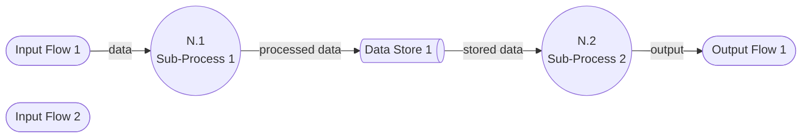

# [N.M] [Process Name]

> Decomposes process [N] from [parent file]

## Diagram

> **Note:** `@{ shape: das }` requires Mermaid v11.3.0+. If your renderer is older, use `[(Data Store 1)]` as a fallback.

## Processes

| Process | Number | Description | Decomposed in |
|---------|--------|-------------|---------------|
| [Name] | N.1 | [What it does] | [File path or "leaf process"] |
| [Name] | N.2 | [What it does] | [File path or "leaf process"] |

> **Citation rule:** Every process description must cite the code that implements it — e.g., "Validates incoming webhook payloads (`src/webhooks/validator.py::validate_payload`, `a1b2c3d`)" or cite the design plan if not yet implemented.

## Data Stores

| Store | Description | Read by | Written by |
|-------|-------------|---------|------------|
| [Name] | [What it holds] | [Process numbers] | [Process numbers] |

> **Citation rule:** Each data store must cite its backing implementation — e.g., database table (`migrations/003_create_events.sql::events`, `d4e5f6a`) or in-memory structure (`src/cache.py::EventCache`, `b1c2d3e`).

## Inputs and Outputs

| Flow | Direction | Source/Destination | Description |
|------|-----------|--------------------|-------------|
| [Name] | In | [Parent process or external entity] | [What data flows] |
| [Name] | Out | [Parent process or external entity] | [What data flows] |

## Cross-References

- **Parent:** [Parent DFD file, e.g., `0-context-diagram.md`]
- **Children:** [Child DFD files, e.g., `N.1-sub-process.md`]
- **Related issues:** [GitHub issue references]
- **Related commits:** [Commit SHAs]

## Numbering

DFD numbers are stable identifiers. Once assigned, a process keeps its number. New processes get the next available number at this level. Gaps are acceptable.
