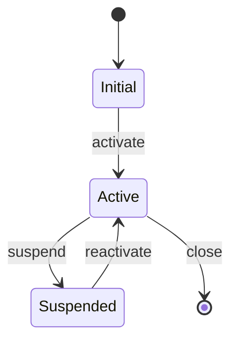

# [Entity Name] Lifecycle

## State Diagram

## States

| State | Description | Entry Conditions | Exit Conditions |
|-------|-------------|-----------------|-----------------|
| Initial | [What this state means] | [How entities enter] | [What triggers transition out] |
| Active | [What this state means] | [How entities enter] | [What triggers transition out] |
| Suspended | [What this state means] | [How entities enter] | [What triggers transition out] |

> **Citation rule:** Each state must cite where it is defined in code — e.g., enum value (`src/models/order.py::OrderStatus.ACTIVE`, `a1b2c3d`) or database column (`migrations/001_create_orders.sql::orders.status`, `d4e5f6a`).

## Transitions

| From | To | Trigger | Side Effects | Reversible? |
|------|----|---------|-------------|-------------|
| Initial | Active | [What causes this] | [What happens as a result] | [Yes/No] |
| Active | Suspended | [What causes this] | [What happens as a result] | [Yes] |

> **Citation rule:** Each transition must cite the code that triggers it — e.g., (`src/services/order.py::OrderService.confirm`, `b2c3d4e`).

## Invariants

- [Rules that must hold across all states, e.g., "An entity cannot transition directly from Initial to Suspended"]
- [Business rules about state combinations]

## Cross-References

- **Database:** [Which table/column stores state, e.g., `orders.status`]
- **Related DFD:** [Which DFD process manages transitions]
- **Related issues:** [GitHub issue references]
