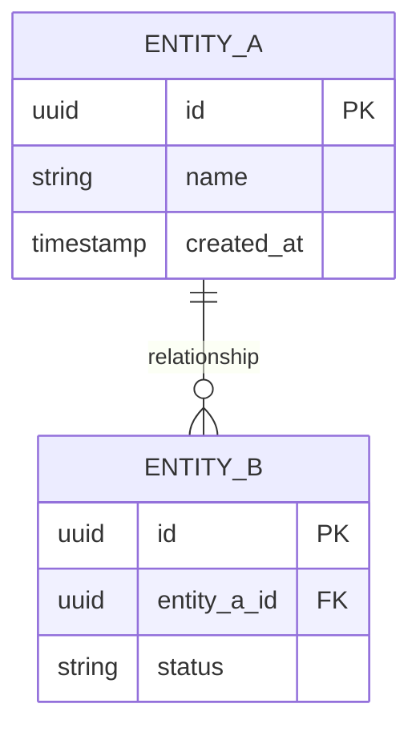
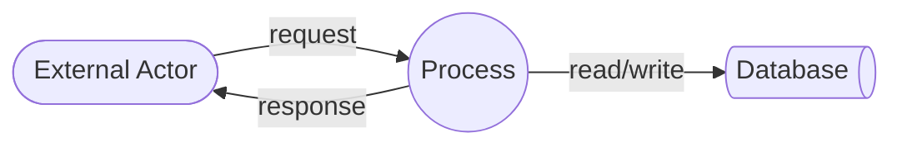

# Database Documentation

## Universe of Discourse

[What this database models. Domain boundaries. Core entities with business definitions. Key business rules that constrain the data.]

## Entity-Relationship Model

## Data Flow Diagrams

[Describe how data moves between system components, external actors, and data stores.]

## Data Dictionary

### [table_name]

| Column | Type | Constraints | Description |
|--------|------|-------------|-------------|
| id | UUID | PK, NOT NULL | [Business meaning] |
| name | VARCHAR(255) | NOT NULL | [Business meaning] |
| created_at | TIMESTAMPTZ | NOT NULL, DEFAULT NOW() | [Business meaning] |

[Repeat for each table.]

## Design Decisions

### [Decision Title]
**Date:** YYYY-MM-DD
**Status:** Proposed | Accepted | Superseded by [link] | Deprecated
**Confidence:** High | Medium | Low
**Reevaluation triggers:** [Conditions under which to revisit]

**Context:** [Why this decision was needed]
**Decision:** [What was decided]
**Consequences:**
- **Enables:** [What this unlocks]
- **Prevents:** [What this forecloses]
**Alternatives rejected:** [What else was considered and why it was rejected]

## Denormalisation Register

[If no denormalisation exists, state: "No denormalisation. All tables are in 3NF or higher."]

| Table | Column | Denormalised from | Justification | Sync mechanism |
|-------|--------|-------------------|---------------|----------------|
| [table] | [column] | [source table.column] | [Why denormalised] | [How kept in sync] |
