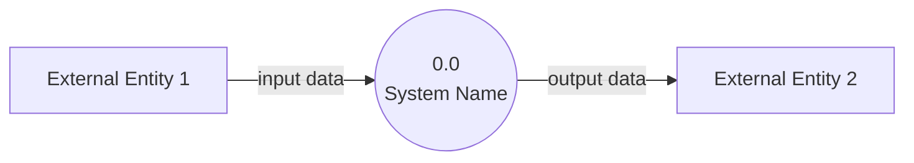

# Context Diagram (Level 0)

> System boundary: [System Name]

## Diagram

## External Entities

| Entity | Description | Inputs to System | Outputs from System |
|--------|-------------|-----------------|---------------------|
| [Name] | [What it is] | [Data it sends] | [Data it receives] |

## System Boundary

**In scope:** [What the system does]

**Out of scope:** [What external entities handle]

## Cross-References

- **Parent:** None (this is the top-level diagram)
- **Children:** [List level-1 DFD files, e.g., `1-subsystem.md`]
- **Related issues:** [GitHub issue references]
- **Related commits:** [Commit SHAs where this was established/modified]
